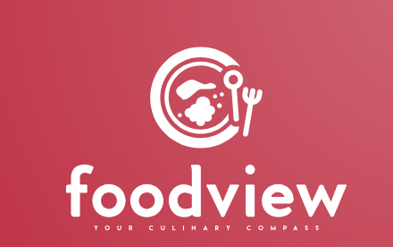

  

# Universidad Peruana de Ciencias Aplicadas

## Carrera de Ingeniería de Software

“Informe de Trabajo Final”

Startup: Rank & Dine Crew

Producto: FoodView

|          Integrantes           |   Código   |
| :----------------------------: | :--------: |
|      Ramos Carpio, Karen       | U20201E493 |

Noviembre 2024

 
 
 
 
 
 
 
 
 

# **Registro de Versiones**

<table>
  <thead>
    <tr>
        <th>Versión</th>
        <th>Fecha</th>
        <th>Autor</th>
        <th>Descripción de modificación</th>
    </tr>
  </thead>
  <tbody>
  <tr>
      <td><strong>TB1</strong></td>
      <td>Jueves 04 de Setiembre</td>
      <td>
        <ul>
          <li>Ramos Carpio, Karen</li>
        </ul>
      </td>
      <td>
        Se han incluído los siguientes capítulos:
        <ul>
          <li>Capítulo I: Introducción</li>
          <li>Capítulo II: Requirements Elicitation & Analysis</li>
          <li>Capítulo III: Requirements Specification</li>
          <li>Capítulo IV: Product Design</li>
          <li>Avance del Capítulo V: Product Implementation, Validation & Deployment hasta el punto 5.2.1.8 Sprint 1</li>
          <li>Avance de Conclusiones, Bibliografía y Anexos</li>
        </ul>
      </td>
  </tr>
  </tbody>
</table>

 
 
 
 
 
 
 
 
 
 
 
 
 

# **Student Outcomes**

<table style="border-collapse: collapse; width: 100%; border: 1px solid black;">
  <thead>
    <tr style="border-bottom: 1px solid black;">
      <th style="border-right: 1px solid black;">Criterio Específico</th>
      <th style="border-right: 1px solid black;">Acciones Realizadas</th>
      <th>Conclusiones</th>
    </tr>
  </thead>
    <tbody>
   
  </tbody>
</table>

# **Project Report Online**

URL Project Report (Github):

### [Capítulo I: Introducción]()
- [1.1. Startup Profile]()
    - [1.1.1 Descripción de la Startup]()
    - [1.1.2 Perfiles de integrantes del equipo]()
- [1.2 Solution Profile]()
    - [1.2.1 Antecedentes y problemática]()
    - [1.2.2 Lean UX Process]()
        - [1.2.2.1. Lean UX Problem Statements]()
        - [1.2.2.2. Lean UX Assumptions]()
        - [1.2.2.3. Lean UX Hypothesis Statements]()
        - [1.2.2.4. Lean UX Canvas]()
- [1.3. Segmentos objetivo]()

### [Capítulo II: Requirements Elicitation & Analysis]()
- [2.1. Competidores]()
    - [2.1.1. Análisis competitivo]()
    - [2.1.2. Estrategias y tácticas frente a competidores]()
- [2.2. Entrevistas]()
    - [2.2.1. Diseño de entrevistas]()
    - [2.2.2. Registro de entrevistas]()
    - [2.2.3. Análisis de entrevistas]()
- [2.3. Needfinding]()
    - [2.3.1. User Personas]()
    - [2.3.2. User Task Matrix]()
    - [2.3.3. User Journey Mapping]()
    - [2.3.4. Empathy Mapping]()
    - [2.3.5. As-is Scenario Mapping]()
- [2.4. Ubiquitous Language]()

### [Capítulo III: Requirements Specification]()
- [3.1. To-Be Scenario Mapping]()
  - [To - Be User Profesionales y Empresas](#to---be-user-empresa)
  - [To - Be User Finanzas Personales](#to---be-user-personal)
- [3.2. User Stories]()
- [3.3. Impact Mapping]()
- [3.4. Product Backlog]()

### [Capítulo IV: Product Design]()
- [4.1. Style Guidelines]()
    - [4.1.1. General Style Guidelines]()
    - [4.1.2. Web Style Guidelines]()
- [4.2. Information Architecture]()
    - [4.2.1. Organization Systems]()
    - [4.2.2. Labeling Systems]()
    - [4.2.3. SEO Tags and Meta Tags]()
    - [4.2.4. Searching Systems]()
    - [4.2.5. Navigation Systems]()
- [4.3. Landing Page UI Design]()
    - [4.3.1. Landing Page Wireframe]()
    - [4.3.2. Landing Page Mock-up]()
- [4.4. Web Applications UX/UI Design]()
    - [4.4.1. Web Applications Wireframes]()
    - [4.4.2. Web Applications Wireflow Diagrams]()
    - [4.4.3. Web Applications Mock-ups]()
    - [4.4.4. Web Applications User Flow Diagrams]()
- [4.5. Web Applications Prototyping]()
- [4.6. Domain-Driven Software Architecture]()
    - [4.6.1. Software Architecture Context Diagram]()
    - [4.6.2. Software Architecture Container Diagrams]()
    - [4.6.3. Software Architecture Components Diagrams]()
- [4.7. Software Object-Oriented Design]()
    - [4.7.1. Class Diagrams]()
    - [4.7.2. Class Dictionary]()
- [4.8. Database Design]()
    - [4.8.1. Database Diagram]()

### [Capítulo V: Product Implementation, Validation & Deployment]()
- [5.1. Software Configuration Management]()
    - [5.1.1. Software Development Environment Configuration]()
    - [5.1.2. Source Code Management]()
    - [5.1.3. Source Code Style Guide & Conventions]()
    - [5.1.4. Software Deployment Configuration]()
- [5.2. Landing Page, Services & Applications Implementation]()
    - [5.2.1. Sprint 1]()
        - [5.2.1.1. Sprint Planning 1]()
        - [5.2.1.2. Sprint Backlog 1]()
        - [5.2.1.3. Development Evidence for Sprint Review]()
        - [5.2.1.4. Testing Suite Evidence for Sprint Review]()
        - [5.2.1.5. Execution Evidence for Sprint Review]()
        - [5.2.1.6. Services Documentation Evidence for Sprint Review]()
        - [5.2.1.7. Software Deployment Evidence for Sprint Review]()
        - [5.2.1.8. Team Collaboration Insights during Sprint]()
    - [5.2.2. Sprint 2]()
        - [5.2.2.1. Sprint Planning 2]()
        - [5.2.2.2. Sprint Backlog 2]()
        - [5.2.2.3. Development Evidence for Sprint Review]()
        - [5.2.2.4. Testing Suite Evidence for Sprint Review]()
        - [5.2.2.5. Execution Evidence for Sprint Review]()
        - [5.2.2.6. Services Documentation Evidence for Sprint Review]()
        - [5.2.2.7. Software Deployment Evidence for Sprint Review]()
        - [5.2.2.8. Team Collaboration Insights during Sprint]()
    - [5.2.3. Sprint 3]()
        - [5.2.3.1. Sprint Planning 3]()
        - [5.2.3.2. Sprint Backlog 3]()
        - [5.2.3.3. Development Evidence for Sprint Review]()
        - [5.2.3.4. Testing Suite Evidence for Sprint Review]()
        - [5.2.3.5. Execution Evidence for Sprint Review]()
        - [5.2.3.6. Services Documentation Evidence for Sprint Review]()
        - [5.2.3.7. Software Deployment Evidence for Sprint Review]()
        - [5.2.3.8. Team Collaboration Insights during Sprint]()
    - [5.2.4. Sprint 4]()
        - [5.2.4.1. Sprint Planning 4]()
        - [5.2.4.2. Sprint Backlog 4]()
        - [5.2.4.3. Development Evidence for Sprint Review]()
        - [5.2.4.4. Testing Suite Evidence for Sprint Review]()
        - [5.2.4.5. Execution Evidence for Sprint Review]()
        - [5.2.4.6. Services Documentation Evidence for Sprint Review]()
        - [5.2.4.7. Software Deployment Evidence for Sprint Review]()
        - [5.2.4.8. Team Collaboration Insights during Sprint]()
- [5.3. Validation Interviews]()
    - [5.3.1. Diseño de Entrevistas]()
    - [5.3.2. Registro de Entrevistas]()
    - [5.3.3. Evaluaciones según heurísticas]()
- [5.4. Video About-the-Product]()

---
# Capítulo I: Introducción
## 1.1. Startup Profile

Esta sección proporciona una visión integral de la startup, incluyendo una descripción detallada de su misión, visión, y el producto que ofrece. Además, se presentan los perfiles de los miembros clave del equipo, destacando sus habilidades, experiencia y contribuciones al desarrollo y éxito de la empresa. Aquí se busca brindar una comprensión completa de la identidad y el potencial del startup, así como de las personas que impulsan su crecimiento.

### 1.1.1 Descripción de la Startup

*FoodView* es una aplicación innovadora que redefine la forma en que las personas eligen qué comer. A diferencia de otras plataformas de reseñas generales, nuestro enfoque se centra en la calificación de platos individuales, permitiendo a los usuarios descubrir qué comer con base en experiencias reales.
Nuestro sistema único de ranking por colores (verde, amarillo, rojo, etc.) simplifica la evaluación de cada establecimiento en función de su calidad y precio, brindando una referencia visual clara y rápida. Además, la aplicación cuenta con filtros personalizables, permitiendo a los usuarios encontrar opciones según su presupuesto, preferencias culinarias y ubicación.
Con una interfaz intuitiva y una comunidad de foodies compartiendo sus experiencias, *FoodView* se convierte en la brújula gastronómica definitiva, ayudando a los comensales a tomar mejores decisiones al momento de elegir dónde y qué comer.

**Misión:** Facilitar a los comensales la elección de los mejores platos a través de un sistema de calificación visual basado en colores, brindando información clara, confiable y colaborativa. Nos comprometemos a mejorar la experiencia gastronómica al conectar a los usuarios con reseñas auténticas y detalladas, ayudando a restaurantes y consumidores a ofrecer y disfrutar mejores opciones culinarias.

**Visión:** Ser la plataforma líder en recomendaciones gastronómicas, revolucionando la forma en que las personas descubren y eligen qué comer mediante un sistema visual intuitivo y confiable. Aspiramos a construir una comunidad global donde la calidad y el valor de cada plato sean reconocidos de manera justa y accesible para todos.

**Logotipo del servicio:**

**Logotipo del producto:**

### 1.1.2 Perfiles de integrantes del equipo

<TABLE BORDER>
	<TR>
		<TH><h2>Intregantes</h2></TH> 
		<TH><h2>Descripción</h2></TH>
		<TH><h2>Conocimientos</h2></TH>
	</TR>
	<TR>
		<td style="text-align: center" align="center">
 Karen Ramos Carpio - U20201E493  
</td>
		<td style="text-align: center" align="center">Cuento con gran capacidad de autoaprendizaje, esto me permite alcanzar mejores índices de productividad para la empresa de forma individual como en trabajo en equipo para poder llegar a los 		objetivos definidos por la empresa.Tengo un alto sentido del compromiso y la responsabilidad por lo que puedo garantizar que la tarea que me sea asignada será gestionada con diligencia.</td>
		<td style="text-align: center" align="center">Desarrollador entusiasta de resolución de problemas de .NET con experiencia en C#, JavaScript, TypeScript, Golang, C++, HTML CSS. Además de .NET, .Net Core, Angular, React y Kendo UI. 			Trabaja bien tanto individualmente como en un ambiente de equipo. Como profesional de TI, me dedico a administrar mis proyectos hasta su finalización, asegurándose de que se completen en el plazo establecido</td>
	</TR>
  <TR>
		<td style="text-align: center" align="center">
 Cristian Luis Iparraguirre Rueda - U202113111   
</td> 
		<td style="text-align: center" align="center">Soy una persona con habilidades de aprendizaje rápido, lo que me permite optimizar tanto mi trabajo individual como en equipo para alcanzar los objetivos establecidos. Tengo experiencia trabajando en equipo, contribuyendo con ideas creativas y soluciones prácticas. Me apasiona aprender sobre nuevas tecnologías y mantengo una actitud perseverante en el desarrollo de cualquier proyecto.</td>
		<td style="text-align: center" align="center">Tengo conocimientos sólidos en C++, Java, Python, SQL y NoSQL, así como en el desarrollo web con HTML, CSS y JavaScript. Mi enfoque está en la resolución de problemas a través de la programación y en el manejo de bases de datos. Disfruto aprendiendo y explorando nuevas tecnologías, lo que me permite optimizar mis proyectos para que se completen de manera innovadora y efectiva.</td>
	</TR>
  <TR>
		<td style="text-align: center" align="center">
 Melina Liz Santillan Alvarado - U202216058   
</td> 
		<td style="text-align: center" align="center">Me considero una persona responsable e innovadora, además realizo un buen trabajo en equipo. Por otro lado, voy a ayudar en todo lo que pueda en el proyecto para que este sea un éxito.</td>
		<td style="text-align: center" align="center">Tengo conocimientos en C++, HTML y CSS. Además, tengo un buen manejo del inglés. Soy una persona que le gusta enriquecer sus aprendizajes.</td>
	</TR>
</TABLE>

## 1.2 Solution Profile
### 1.2.1 Antecedentes y problemática
Para identificar el contexto en el que se situa FinanceGuard, utilizaremos la técnica de las 5 W's y 2 H's.

#### 1.2.1.1. Las 5 W's:

- **What (Qué):** 
FinanceGuard es una plataforma digital diseñada para simplificar la gestión de finanzas tanto personales como empresariales. Permite a los usuarios organizar y compartir gastos, gestionar deudas, y seguir objetivos financieros. Además, ofrece herramientas avanzadas para la conciliación de cuentas y la generación de reportes contables.

- **Why (Por qué):** 
Existe una necesidad creciente de herramientas que faciliten la gestión financiera, especialmente en contextos de colaboración como grupos de amigos, compañeros de cuarto, parejas, y empresas. FinanceGuard responde a esta necesidad ofreciendo una solución que promueve la transparencia, la organización y la estabilidad financiera.

- **Who (Quién):** 
El producto está dirigido a individuos que comparten gastos con otros, como amigos, compañeros de cuarto, parejas, y familiares, así como a pequeñas y medianas empresas que requieren herramientas eficientes para la gestión contable y financiera.

- **Where (Dónde):** 
FinanceGuard se implementa como una aplicación móvil y web, accesible desde cualquier lugar con conexión a internet, lo que permite a los usuarios gestionar sus finanzas en tiempo real, sin importar su ubicación.

- **When (Cuándo):** 
El uso de FinanceGuard es continuo, permitiendo a los usuarios realizar un seguimiento constante de sus finanzas, tanto en el día a día como a largo plazo, ajustándose a sus necesidades en cualquier momento.

#### 1.2.1.2. Las 2 H's:

- **How (Cómo):** 
FinanceGuard funciona mediante la creación de grupos donde los usuarios pueden agregar y gestionar gastos compartidos. La plataforma automatiza el cálculo de deudas y saldos, proporciona herramientas para establecer y seguir objetivos financieros, y ofrece funciones específicas para la gestión empresarial, como la conciliación de cuentas y la generación de reportes.

- **How much (Cuánto):** 
El modelo de negocio puede incluir diferentes niveles de suscripción, desde una versión gratuita con funciones básicas hasta planes de pago que ofrecen características avanzadas para usuarios personales y empresariales. El costo variará según el nivel de acceso y las herramientas necesarias para cada tipo de usuario.

### 1.2.2 Lean UX Process
#### 1.2.2.1. Lean UX Problem Statements
FinanceGuard es una plataforma integral diseñada para la gestión de finanzas personales y empresariales. Su objetivo es ofrecer a los usuarios una solución completa para el seguimiento de gastos, la organización de presupuestos, y la optimización de recursos económicos, tanto a nivel individual como para pequeñas y medianas empresas.

Hemos identificado que en el contexto actual, muchas personas y organizaciones enfrentan dificultades significativas debido a la falta de herramientas efectivas para la administración financiera. La dependencia de métodos manuales, como hojas de cálculo y registros dispersos, conlleva a problemas de desorganización, errores en el seguimiento de gastos, y una gestión ineficiente de los recursos económicos. Esto puede resultar en desequilibrios presupuestarios, pérdidas económicas, y dificultades para alcanzar metas financieras, afectando tanto la estabilidad financiera como la capacidad de toma de decisiones informadas.

¿Cómo podríamos abordar estos problemas mediante una herramienta que integre y automatice la gestión financiera, proporcionando una visión clara y accesible de los ingresos, gastos y deudas? La solución debería simplificar la planificación financiera, mejorar la precisión en el seguimiento de metas económicas y facilitar la toma de decisiones estratégicas, contribuyendo así a una mayor estabilidad y éxito financiero a largo plazo.

#### 1.2.2.2. Lean UX Assumptions

##### 1.2.2.2.1. Assumptions:

- Existe una demanda en el mercado para una solución digital que simplifique la gestión de finanzas personales y empresariales, ayudando a los usuarios a mantener un control más preciso sobre sus recursos económicos.
- Los individuos y las pequeñas y medianas empresas están dispuestos a adoptar una plataforma digital para la administración financiera, reconociendo sus beneficios en términos de claridad, eficiencia y toma de decisiones.
- La plataforma será técnicamente viable y escalable, capaz de manejar grandes volúmenes de datos financieros y operaciones complejas.
- Se espera que la plataforma proporcione a los usuarios una mejora significativa en la organización de sus finanzas, reduciendo el riesgo de errores y facilitando la planificación financiera.
- Se asume que una interfaz de usuario intuitiva y fácil de usar será clave para la aceptación y adopción generalizada de la plataforma.
- Se anticipa que la plataforma ofrecerá funcionalidades de integración con otras herramientas financieras y bancos para facilitar una gestión financiera más coherente y completa.

##### 1.2.2.2.2. Features:

- La plataforma permitirá el seguimiento en tiempo real de gastos e ingresos, facilitando una gestión financiera precisa y actualizada.
- Integrará funcionalidades para la creación y seguimiento de presupuestos y metas financieras, ayudando a los usuarios a planificar y ajustar sus finanzas de manera efectiva.
- Ofrecerá herramientas automáticas para el cálculo de deudas y saldos, proporcionando una visión clara de las obligaciones financieras entre los usuarios.
- Incorporará alertas automáticas y recordatorios para fechas límite de pagos y vencimientos de presupuestos, ayudando a evitar retrasos y cargos adicionales.
- Dispone de una interfaz intuitiva y fácil de usar que permite a los usuarios gestionar sus finanzas de manera sencilla y accesible.
- Ofrecerá capacidades de generación de reportes financieros detallados y personalizados, facilitando la toma de decisiones y la planificación estratégica.

#### 1.2.2.3. Lean UX Hypothesis Statements
- **1st Hypothesis Statement:**  
Nosotros creemos que si implementamos una función de categorización automática de gastos en FinanceGuard,
Cuando los usuarios registren nuevas transacciones en la plataforma,
Veremos que la clasificación y organización de los gastos mejorará, y los usuarios podrán generar reportes financieros más precisos y detallados sin esfuerzo adicional,
Mediremos esto a través de la comparación del tiempo invertido en categorizar gastos manualmente antes y después de la implementación, así como la retroalimentación de los usuarios sobre la precisión y utilidad de la categorización automática.

- **2nd Hypothesis Statement:**  
Nosotros creemos que si desarrollamos una función de alertas personalizadas para vencimientos de pagos y metas financieras en FinanceGuard,
Cuando los usuarios configuren sus alertas y realicen un seguimiento de sus pagos y objetivos en la plataforma,
Veremos que la puntualidad en los pagos y el cumplimiento de metas financieras mejorará, reduciendo la cantidad de cargos por pagos atrasados y ayudando a los usuarios a alcanzar sus metas con mayor eficacia,
Mediremos esto a través de la comparación de la cantidad de cargos por pagos atrasados y la tasa de cumplimiento de metas antes y después de la implementación de las alertas personalizadas, así como la retroalimentación de los usuarios sobre la efectividad y utilidad de las alertas.

- **3rd Hypothesis Statement:**  
Nosotros creemos que si integramos una herramienta de análisis de tendencias financieras en FinanceGuard que utilice datos históricos para predecir patrones de gastos e ingresos,
Cuando los usuarios consulten estos análisis para planificar su presupuesto y ajustar sus gastos,
Veremos que la precisión en la planificación financiera y la toma de decisiones mejorará, permitiendo a los usuarios evitar desajustes presupuestarios y optimizar su administración económica,
Mediremos esto a través de la comparación de la precisión en la planificación financiera antes y después de la integración del análisis de tendencias, así como la evaluación del impacto en la satisfacción del usuario y la eficiencia en la gestión del presupuesto a través de encuestas y métricas de uso.

#### 1.2.2.4. Lean UX Canvas

| **Business Problema**   Desarrollar una plataforma digital que permita a los usuarios gestionar de manera eficaz tanto sus finanzas personales como empresariales. La solución debe facilitar la organización de gastos compartidos, la optimización del flujo de efectivo y la planificación financiera. El desafío radica en la ausencia de herramientas integradas y fáciles de usar que permitan a las personas y a las empresas controlar sus gastos y establecer metas financieras de manera eficiente. Los métodos actuales suelen ser ineficaces y propensos a errores, lo que afecta la capacidad de tomar decisiones financieras informadas y precisas. | **Solution Ideas**   1. Crear una plataforma digital que facilite la gestión de finanzas personales y empresariales mediante la integración de herramientas de seguimiento y análisis de gastos.  2. Implementar funcionalidades para la creación de grupos de gasto, permitiendo a los usuarios dividir y gestionar gastos compartidos de manera clara y eficiente.  3. Desarrollar herramientas de planificación financiera que permitan a los usuarios establecer y seguir metas económicas, ajustando sus presupuestos según sus objetivos.  4. Ofrecer integración con cuentas bancarias y otras herramientas digitales para una experiencia fluida y centralizada en la gestión financiera.  5. Incluir características para el análisis y reporte de gastos, proporcionando a los usuarios información detallada y útil para la toma de decisiones financieras. | **Business Outcomes**   La implementación de FinanceGuard busca ofrecer una solución integral que mejore la eficiencia en la gestión financiera tanto para individuos como para empresas. Se espera que la plataforma facilite una organización más efectiva de los gastos, reduzca los errores asociados con métodos manuales y mejore la toma de decisiones financieras. Los resultados deseados incluyen una mayor claridad en el manejo del dinero, la optimización del flujo de efectivo y la capacidad de alcanzar metas financieras con mayor confianza. A largo plazo, se busca posicionar a FinanceGuard como una herramienta líder en la gestión financiera, apreciada por su facilidad de uso y su impacto positivo en la estabilidad económica de sus usuarios. |
| ---    | ----     | ---      | 
| 
 **Users & Customers**    Los usuarios y clientes de FinanceGuard incluyen:   1. **Profesionales y Empresas:** Estos usuarios buscan una solución robusta para gestionar finanzas empresariales, controlar gastos y optimizar el flujo de efectivo. Necesitan herramientas que faciliten la conciliación de cuentas, la generación de reportes contables y el seguimiento detallado de las finanzas empresariales.    2. **Usuarios de Finanzas Personales** Este segmento está compuesto por individuos interesados en mejorar su control presupuestario, seguir sus gastos y planificar financieramente para el futuro. Valoran soluciones digitales que les ayuden a mantener una visión clara y organizada de sus finanzas personales. 
 |  | 
 **User Benefits**    Los beneficios para los usuarios de FinanceGuard incluyen:   1. Mejora en la organización y seguimiento de gastos tanto personales como empresariales.  2. Capacidad para dividir y gestionar gastos compartidos de manera eficiente.  3. Herramientas de planificación financiera que facilitan la definición y el seguimiento de metas económicas.  4. Integración con cuentas bancarias y herramientas digitales para una gestión financiera centralizada y fluida.  5. Reportes detallados y análisis que permiten una mejor toma de decisiones financieras.
   6. Optimización del flujo de efectivo y reducción de errores asociados con métodos manuales. | 
| 
 **Hypothesis Statement**   Nosotros creemos que al implementar FinanceGuard como una solución integral para la gestión financiera:  **Hipótesis 1:** Creemos que al simplificar el proceso de registro y seguimiento de gastos en FinanceGuard, los usuarios mejorarán su capacidad para organizar y controlar sus finanzas. Esto se medirá mediante la comparación de la eficiencia en la gestión de gastos antes y después de la implementación, y la retroalimentación de los usuarios sobre la facilidad de uso.  **Hipótesis 2:** Si incorporamos herramientas de planificación financiera que permitan a los usuarios establecer y seguir metas económicas, mejoraremos la capacidad de los usuarios para alcanzar sus objetivos financieros. La validación se hará a través de la evaluación del progreso hacia las metas antes y después de la implementación, y recopilando la retroalimentación sobre la utilidad de estas herramientas.  **Hipótesis 3:** Al integrar FinanceGuard con cuentas bancarias y otras herramientas digitales, se facilitará una gestión financiera más centralizada y precisa. Esto se evaluará comparando la efectividad en la gestión financiera antes y después de la integración, y mediante encuestas para evaluar la satisfacción del usuario con la integración de estas herramientas.  
| 
 **What's the most important thing we need to learn first?**    Lo más importante que necesitamos aprender primero es comprender las necesidades específicas de los usuarios tanto individuales como empresariales en la gestión de sus finanzas. Esto nos permitirá diseñar funcionalidades que realmente aborden sus problemas y optimicen su experiencia en la gestión financiera. 
| 
 **What's the least amount of work we need to do learn the next most important thing?**    Para aprender lo siguiente más importante, necesitamos realizar entrevistas breves con usuarios potenciales para identificar sus desafíos y necesidades en la gestión de finanzas. Adicionalmente, revisaremos estudios de mercado y tendencias en herramientas de gestión financiera para obtener información relevante y actualizada que guíe el desarrollo de FinanceGuard.
 |

## 1.3. Segmentos objetivo

FinanceGuard se dirige a dos audiencias meta clave: *Profesionales y Empresas* y *Usuarios de Finanzas Personales*. La plataforma está diseñada para ofrecer soluciones financieras adaptadas a las necesidades específicas de cada grupo, asegurando una gestión efectiva y personalizada de sus recursos económicos.

**Profesionales y Empresas:** Este grupo incluye pequeñas y medianas empresas (PYMES), grandes corporaciones y profesionales independientes que requieren una solución avanzada para la gestión de finanzas empresariales. Buscan optimizar el control de gastos, mejorar la gestión del flujo de efectivo y obtener informes financieros detallados que faciliten la toma de decisiones estratégicas.

**Usuarios de Finanzas Personales:** Este segmento está compuesto por individuos interesados en mejorar la administración de sus finanzas personales. Buscan una plataforma que les permita controlar sus presupuestos, seguir sus gastos y planificar sus objetivos financieros con precisión, facilitando una visión clara y organizada de su situación económica.

# Capítulo II: Requirements Elicitation & Analysis
## 2.1 Competidores

### 2.1.1. Análisis Competitivo

<table border>
    <thead>
        <tr >
            <th colspan=6 style="text-align: center">
				<h2>
					Competitive Analisis Landscape
				</h2>
			</th>
        </tr>
    </thead>
    <tbody>
        <tr>
            <td colspan=2 rowspan=2 style="text-align: center" align="center">¿Por qué llevar a cabo este análisis?</td>
            <td colspan=4 style="text-align: center" align="center">¿Quiénes son nuestros principales competidores?</td>
        </tr>
		<tr>
            <td colspan=4 style="text-align: center" align="center">Gracias al análisis de la competencia, se logra comprender el entorno competitivo en el que operará nuestro producto. Esto proporciona una visión detallada de quienes son nuestros competidores directos e indirectos, logrando así, trazar 
 una estretegia sólida para alcanzar la máxima exposición de nuestro producto, llegando así a más posibles consumidores.</td>
        </tr>
		<tr>
			<td rowspan=3 style="text-align: center" align="center">Perfil</td>
			<td rowspan=2 style="text-align: center" align="center">Overview</td>
      <td style="text-align: center" align="center">FinanceGuard 

</td>
			<td style="text-align: center" align="center">Mint 

</td>
			<td style="text-align: center" align="center">Personal Capital 

</td>
			<td style="text-align: center" align="center">GoodBudget 

</td>
		</tr>
		<tr>
			<td style="text-align: center" align="center">Plataforma que busca facilitar el proceso de división de costos en diversas situaciones, con varias herramientas que son de utilidad en dicho momento</td>
			<td style="text-align: center" align="center">Plataforma que busca dividir los gastos grupales en viajes o comidas.</td>
			<td style="text-align: center" align="center">Plataforma colaborativa que busca dividir todo tipo de gastos grupales.</td>
			<td style="text-align: center" align="center">Plataforma que busca, de forma colaborativa, llevar un recuento de todos los gastos grupales que se hacen.</td>
		</tr>
		<tr>
			<td style="text-align: center" align="center">Ventaja Competitiva ¿Qué valor ofrecen a los clientes</td>
			<td style="text-align: center" align="center"><ul><li>Organización por grupos y etiquetas</li> <li>Notificaciones en tiempo real</li> <li>Beneficios adicionales por plan premium</li></ul> </td>
			<td style="text-align: center" align="center"><ul><li>Simplicidad de la plataforma</li> <li>Exportar a pdf o cvs</li> <li>No requiere registro</li></ul> </td>
			<td style="text-align: center" align="center"><ul><li>División desigual de gastos</li> <li>Guardado de fotos</li> <li>Notificaciones en tiempo real</li></ul> </td>
			<td style="text-align: center" align="center"><ul><li>Facilidad de uso</li> <li>Sincronización en la nube</li> <li>Métodos de pago integrados</li> <li>Funciones pro adicionales</li></ul> </td>
		</tr>
		<tr>
			<td rowspan=2 style="text-align: center" align="center">Perfil del Marketing</td>
			<td style="text-align: center" align="center">Mercado Objetivo</td>
			<td style="text-align: center" align="center"><ul><li>Viajeros que busquen dividir sus gastos</li> <li>Roomates que quieran dividir los gastos del hogar</li> <li>Grupos de personas que desean dividir los gastos de una cena</li></ul> </td>
			<td style="text-align: center" align="center"><ul><li>Viajes</li> <li>Casas compartidas</li></ul> </td>
			<td style="text-align: center" align="center"><ul><li>Parejas que desean dividir gastos</li> <li>Viajeros que quieren gestionar sus compras</li> <li>Comapñeros de piso</li></ul> </td>
			<td style="text-align: center" align="center"><ul><li>Viajeros</li> <li>Compañeros de piso</li> <li>Parejas</li> <li>Grupos de amigos</li></ul> </td>
		</tr>
		<tr>
			<td style="text-align: center" align="center">Estrategias de Marketing</td>
			<td style="text-align: center" align="center"><ul><li>Uso de publicidad en redes sociales</li> <li>Recomendación de voz a voz</li> <li>Prueba gratis de 30 días del plan premium para lograr retención</li></ul> </td>
			<td style="text-align: center" align="center"><ul><li>Promoción de la app en su cuenta de Twitter</li></ul> </td>
			<td style="text-align: center" align="center"><ul><li>Presentación de referencias en su landing page</li> <li>Cuentas activas de Facebook y Twitter</li></ul> </td>
			<td style="text-align: center" align="center"><ul><li>Presentación en una landing page vistosa</li> <li>Fácil acceso a los contactos para invitar más personas</li> <li>Página de redes sociales</li></ul> </td>
		</tr>
		<tr>
			<td rowspan=3 style="text-align: center" align="center">Perfil del Producto</td>
			<td style="text-align: center" align="center">Productos & Servicios</td>
			<td style="text-align: center" align="center">Sitio web para el registro y uso de nuestro aplicativo</td>
			<td style="text-align: center" align="center">Aplicativo móvil para el uso de la solución</td>
			<td style="text-align: center" align="center">Aplicativo móvil para el uso de la solución</td>
			<td style="text-align: center" align="center">Aplicativo móvil para el uso de la solución</td>
		</tr>
		<tr>
			<td style="text-align: center" align="center">Precios & Costos</td>
			<td style="text-align: center" align="center"><ul><li>Suscripción de un mes - 9.90 soles</li> <li>Suscripción de un año - 29.90 soles</li> <li>Suscripción empresarial - 169.90 soles</li></ul> </td>
			<td style="text-align: center" align="center"><ul><li>Pase de un mes - 2.90 soles</li> <li>Suscripción de un año - 11.90 soles</li> <li>Pase de por vida - 39.90 soles</li></ul> </td>
			<td style="text-align: center" align="center"><ul><li>Suscripción de un mes - 12.90 soles</li> <li>Suscripción de un año - 35.90 soles</li></ul> </td>
			<td style="text-align: center" align="center"><ul><li>Suscripción de un mes - 19.90 soles</li> <li>Suscripción de un año - 149.90 soles</li></ul> </td>
		</tr>
		<tr>
			<td style="text-align: center" align="center">Canales de distribución (web/móvil)</td>
			<td style="text-align: center" align="center">Plataforma web</td>
			<td style="text-align: center" align="center">Plataforma móvil</td>
			<td style="text-align: center" align="center">Plataforma móvil</td>
			<td style="text-align: center" align="center">Plataforma móvil</td>
		</tr>
		<tr>
			<td rowspan=4 style="text-align: center" align="center">Análisis SWOT</td>
			<td style="text-align: center" align="center">Fortalezas</td>
			<td style="text-align: center" align="center"><ul><li>Canales de atención disponibles</li> <li>Cálculo automático de saldos</li> <li>Uso de etiquetas para categorizar y filtrar las transacciones</li></ul> </td>
			<td style="text-align: center" align="center"><ul><li>Funciona offline</li> <li>Se sincroniza de forma automática con nuestros amigos</li></ul> </td>
			<td style="text-align: center" align="center"><ul><li>Uso de imágenes como evidencia</li> <li>Uso de claves de color para mejor visualización</li></ul> </td>
			<td style="text-align: center" align="center"><ul><li>Integración con cuentas de banco para realizar los pagos dentro de la misma aplicación</li> <li>División en partes iguales o desiguales</li></ul> </td>
		</tr>
		<tr>
			<td style="text-align: center" align="center">Debilidades</td>
			<td style="text-align: center" align="center"><ul><li>Requiere de conección a internet</li> <li>No soporta muchos idiomas</li></ul> </td>
			<td style="text-align: center" align="center"><ul><li>El diseño es demasiado simple</li> <li>Carece de diferenciadores con la competencia</li> <li>Cobra por features que se encuentran gratis en otras aplicaciones</li></ul> </td>
			<td style="text-align: center" align="center"><ul><li>La interfaz no es fácil de usar</li> <li>Cobra por features que se encuentran gratis en otras aplicaciones</li></ul> </td>
			<td style="text-align: center" align="center"><ul><li>Te da una cantidad de gastos limitados en el plan gratuito</li> <li>Los planes premium son demasiado costosos</li></ul> </td>
		</tr>
		<tr>
			<td style="text-align: center" align="center">Oportunidades</td>
			<td style="text-align: center" align="center"><ul><li>Es posible agregar más funcionalidades</li> <li>Ya se está empezando a crear un mercado gracias a las otras apps</li></ul> </td>
			<td style="text-align: center" align="center">Se puede agregar un poco más de profundidad al diseño</td>
			<td style="text-align: center" align="center">Se puede mejorar la interfaz para que sea más intuitiva</td>
			<td style="text-align: center" align="center">Es la aplicación con más features</td>
		</tr>
		<tr>
			<td style="text-align: center" align="center">Amenazas</td>
			<td style="text-align: center" align="center">Es comlpicado competir con aplicaciones ya establecidas en el mercado</td>
			<td style="text-align: center" align="center">Sigue quedándose atrás en la cantidad de features que tiene comparado con la competencia</td>
			<td style="text-align: center" align="center">Los consumidores están acostumbrados a aplicaciones intuitivas, por lo que aprender a utilizar una app va a ser complicaco para algunos usuarios</td>
			<td style="text-align: center" align="center">Los precios altos ocasionan que los usuarios no deseen pagar la suscripción</td>
		</tr>
    </tbody>
</table>

## 2.2. Entrevistas
**Objetivo:** El objetivo de las entrevistas es recopilar información detallada sobre las necesidades, expectativas y problemas que enfrentan los usuarios potenciales de "Tech Titans", nuestra aplicación para la gestión y división de gastos grupales. Estas entrevistas ayudarán a comprender mejor los casos de uso y a validar las suposiciones realizadas durante la fase de análisis inicial.

### 2.2.1. Diseño de entrevistas
**Preguntas generales:**
1. **¿Cuál es su nombre completo?**
2. **¿Qué edad tienes?**
3. **¿A qué te dedicas?**
4. **¿En qué ciudad resides?**

**Preguntas Principales:**
1. **¿Cómo gestionas actualmente tus finanzas personales y empresariales?**
2. **¿Qué dificultades enfrentas al intentar organizar tus gastos compartidos o grupales?**
3. **¿Qué características consideras esenciales en una aplicación de gestión financiera?**
4. **¿Qué tan dispuesto estarías a pagar por una herramienta que optimice la gestión de tus finanzas?**
5. **¿Has utilizado alguna herramienta digital para la gestión financiera antes? ¿Cómo fue tu experiencia?**

**Preguntas Complementarias:**
1. **¿Cómo realizas actualmente el seguimiento de tus deudas y saldos con otras personas?**
2. **¿Utilizas alguna herramienta específica para la conciliación de cuentas empresariales?**
3. **¿Cómo te sentirías acerca de recibir notificaciones automáticas para recordarte pagos y vencimientos?**
4. **¿Qué nivel de personalización esperarías de una aplicación de finanzas?**

### 2.2.2. Registro de entrevistas
**Profesionales y Empresas:**

<table style="border: 0.01px solid #555">
    <tr>
        <td colspan="2" style="text-align: center;">
            Entrevista 1
        </td>
    </tr>
    <tr>
        <td colspan="2" style="text-align: center;">
            
        </td>
    </tr>
    <tr>
        <td><strong>Nombre y Apellido</strong></td>
        <td>Luis Iparraguirre Quiñones</td>
    </tr>
    <tr>
        <td><strong>Edad</strong></td>
        <td>48</td>
    </tr>
    <tr>
        <td><strong>Distrito</strong></td>
        <td>Breña</td>
    </tr>
    <tr>
        <td><strong>URL del Video</strong></td>
        <td><a href="https://bit.ly/4e6V321">Video</a></td>
    </tr>
    <tr>
        <td><strong>Timing de Inicio</strong></td>
        <td>[1:11]</td>
    </tr>
    <tr>
        <td><strong>Duración</strong></td>
        <td>[6:13]</td>
    </tr>
        <tr>
        <td><strong>Fecha</strong></td>
        <td>29/08/2024</td>
    </tr>
</table>
Luis, un profesor universitario y emprendedor de 48 años que reside en Lima, gestiona sus finanzas personales y empresariales de manera rudimentaria mediante el uso de Excel y registros manuales en cuadernos. A pesar de su falta de formación financiera, Luis destaca la importancia de centralizar sus operaciones para mejorar su organización, ya que actualmente maneja diferentes métodos de pago sin una visión consolidada. Prefiere una aplicación intuitiva y fácil de usar, dado que no tiene experiencia previa con herramientas digitales financieras, y está dispuesto a pagar por una solución que optimice sus finanzas, siempre que incluya tutoriales y ofrezca un alto nivel de personalización. Su método actual para recordar pagos y deudas se basa en la memoria, lo cual reconoce como poco confiable, y valora la posibilidad de recibir notificaciones automáticas en su celular. Luis muestra una preferencia por servicios personalizados que se adapten completamente a sus necesidades, lo que sugiere la importancia de una interfaz flexible y ajustable. Sus respuestas reflejan un perfil de usuario que valora la simplicidad, la accesibilidad, y la personalización en las herramientas tecnológicas que utiliza.   
<table style="border: 0.01px solid #555">
    <tr>
        <td colspan="2" style="text-align: center;">
            Entrevista 2
        </td>
    </tr>
    <tr>
        <td colspan="2" style="text-align: center;">
            
        </td>
    </tr>
    <tr>
        <td><strong>Nombre y Apellido</strong></td>
        <td>Jean Pierre Francis Iparraguirre Quiñones</td>
    </tr>
    <tr>
        <td><strong>Edad</strong></td>
        <td>38</td>
    </tr>
    <tr>
        <td><strong>Distrito</strong></td>
        <td>Lince</td>
    </tr>
    <tr>
        <td><strong>URL del Video</strong></td>
        <td><a href="https://bit.ly/4cIXlD7">Video</a></td>
    </tr>
    <tr>
        <td><strong>Timing de Inicio</strong></td>
        <td>[0:25]</td>
    </tr>
    <tr>
        <td><strong>Duración</strong></td>
        <td>[2:34]</td>
    </tr>
    <tr>
        <td><strong>Fecha</strong></td>
        <td>29/8/2024</td>
    </tr>
</table>
Jean Pierre, de 38 años y empleado en el Congreso, gestiona sus finanzas personales utilizando aplicaciones bancarias. Aunque encuentra útil estas herramientas, expresa que no siempre son fáciles de entender, lo que dificulta una gestión financiera eficiente. Al enfrentar gastos compartidos, se le complica llevar un control claro entre lo que gasta y lo que cobra. Jean Pierre valora la agilidad, dinamismo, y la inclusión de estadísticas y cuadros en una aplicación de gestión financiera, características que considera esenciales. Aunque está dispuesto a pagar por una herramienta que optimice sus finanzas, es reacio a recibir notificaciones automáticas de pagos y vencimientos, prefiriendo un enfoque menos intrusivo. Resalta la importancia de la personalización en una aplicación, argumentando que cada persona tiene necesidades financieras únicas que deben ser atendidas de manera individual.  
<table style="border: 0.01px solid #555">
    <tr>
        <td colspan="2" style="text-align: center;">
            Entrevista 3
        </td>
    </tr>
    <tr>
        <td colspan="2" style="text-align: center;">
            
        </td>
    </tr>
    <tr>
        <td><strong>Nombre y Apellido</strong></td>
        <td>Renzo Robert Martinez Villanueva</td>
    </tr>
    <tr>
        <td><strong>Edad</strong></td>
        <td>25</td>
    </tr>
    <tr>
        <td><strong>Distrito</strong></td>
        <td>Lima</td>
    </tr>
    <tr>
        <td><strong>URL del Video</strong></td>
        <td><a href="https://youtu.be/o-bUBIzAb7A">Video</a></td>
    </tr>
    <tr>
        <td><strong>Timing de Inicio</strong></td>
        <td>[0:00]</td>
    </tr>
    <tr>
        <td><strong>Duración</strong></td>
        <td>[4:52]</td>
    </tr>
    <tr>
        <td><strong>Fecha</strong></td>
        <td>05/09/24</td>
    </tr>
</table>
Renzo Martinez, de 25 años y supervisor general en Rango Sport S.A.C., enfrenta dificultades para organizar sus finanzas personales y empresariales utilizando hojas de cálculo y aplicaciones básicas. Vive en Lima y encuentra complicado llevar un control claro de los gastos compartidos y conciliar saldos. Para él, una aplicación ideal debe ser fácil de usar, permitir seguimiento en tiempo real y ofrecer reportes detallados. Está dispuesto a pagar por una herramienta que optimice la gestión financiera, aunque ha encontrado que las herramientas digitales actuales carecen de la personalización que necesita. Valora la opción de recibir notificaciones automáticas para no olvidar pagos y vencimientos, y espera poder adaptar la aplicación a sus necesidades específicas.
   

**Usuarios de Finanzas Personales**

<table style="border: 0.01px solid #555">
    <tr>
        <td colspan="2" style="text-align: center;">
            Entrevista 1
        </td>
    </tr>
    <tr>
        <td colspan="2" style="text-align: center;">
            
        </td>
    </tr>
    <tr>
        <td><strong>Nombre y Apellido</strong></td>
        <td>Alessandro Ramiro Condori Lozano</td>
    </tr>
    <tr>
        <td><strong>Edad</strong></td>
        <td>21</td>
    </tr>
    <tr>
        <td><strong>Distrito</strong></td>
        <td>San Juan de Lurigancho</td>
    </tr>
    <tr>
        <td><strong>URL del Video</strong></td>
        <td><a href="http://bit.ly/4g7UTJi">Video</a></td>
    </tr>
    <tr>
        <td><strong>Timing de Inicio</strong></td>
        <td>[0:34]</td>
    </tr>
    <tr>
        <td><strong>Duración</strong></td>
        <td>[3:20]</td>
    </tr>
    <tr>
        <td><strong>Fecha</strong></td>
        <td>29/08/2024</td>
    </tr>
</table>
Alessandro, un joven de 21 años y estudiante de ingeniería de software en Lima, admite que actualmente no lleva un control adecuado de sus finanzas personales, manejando sus gastos de manera informal y sin organización. Frente a la necesidad de mejorar esta situación, Alessandro valora la idea de una aplicación que no solo le permita gestionar sus finanzas, sino que también le enseñe a hacerlo de manera efectiva, con recomendaciones personalizadas. Aunque nunca ha utilizado herramientas digitales de gestión financiera, muestra disposición a pagar por una solución que realmente aporte beneficios tangibles a su vida financiera. Alessandro sigue sus deudas y saldos utilizando un calendario, lo que indica una falta de centralización y automatización en sus procesos financieros. Considera que recibir notificaciones automáticas sería muy útil para no olvidar pagos o vencimientos, dada su ocupada vida como estudiante. Además, espera que una aplicación de finanzas ofrezca un alto nivel de personalización adaptado a sus patrones de gasto y objetivos personales, lo que refleja su deseo de tener una herramienta que se ajuste a sus necesidades específicas.  

<table style="border: 0.01px solid #555">
    <tr>
        <td colspan="2" style="text-align: center;">
            Entrevista 2
        </td>
    </tr>
    <tr>
        <td colspan="2" style="text-align: center;">
            
        </td>
    </tr>
    <tr>
        <td><strong>Nombre y Apellido</strong></td>
        <td>Aldo Alexander Vasquez Sotomayor</td>
    </tr>
    <tr>
        <td><strong>Edad</strong></td>
        <td>20</td>
    </tr>
    <tr>
        <td><strong>Distrito</strong></td>
        <td>Pueblo libre</td>
    </tr>
    <tr>
        <td><strong>URL del Video</strong></td>
        <td><a href="https://bit.ly/4dVsRiq">Video</a></td>
    </tr>
    <tr>
        <td><strong>Timing de Inicio</strong></td>
        <td>[0:38]</td>
    </tr>
    <tr>
        <td><strong>Duración</strong></td>
        <td>[3:59]</td>
    </tr>
    <tr>
        <td><strong>Fecha</strong></td>
        <td>29/8/2024</td>
    </tr>
</table>
Aldo, un estudiante universitario de 20 años que reside en Pueblo Libre, Lima, gestiona sus finanzas personales utilizando una combinación de hojas de cálculo en Excel y una aplicación móvil. Aunque este método le permite registrar sus gastos diarios, reconoce que es un proceso manual, que consume tiempo y es propenso a errores, especialmente al intentar seguir un presupuesto. Aldo enfrenta dificultades al organizar gastos compartidos, ya que mantener un registro claro y evitar confusiones en los saldos es complicado y puede llevar a discusiones innecesarias. Para él, una aplicación de gestión financiera ideal debe incluir categorización automática de gastos, integración con bancos, herramientas para crear y seguir presupuestos, y notificaciones para recordatorios de pagos. A pesar de haber utilizado varias aplicaciones para dividir gastos y seguir sus finanzas personales, ninguna ha cubierto todas sus necesidades de manera integral, lo que le lleva a combinar varias herramientas. Prefiere recibir notificaciones automáticas sobre transacciones y vencimientos para sentirse más seguro en la gestión de sus finanzas. Aldo valora un alto nivel de personalización en una aplicación de finanzas, con un enfoque en mostrar el saldo actual de manera sencilla y accesible.  

<table style="border: 0.01px solid #555">
    <tr>
        <td colspan="2" style="text-align: center;">
            Entrevista 3
        </td>
    </tr>
    <tr>
        <td colspan="2" style="text-align: center;">
            
        </td>
    </tr>
    <tr>
        <td><strong>Nombre y Apellido</strong></td>
        <td>Alonso Fernando Robles Asuñaupa</td>
    </tr>
    <tr>
        <td><strong>Edad</strong></td>
        <td>20</td>
    </tr>
    <tr>
        <td><strong>Distrito</strong></td>
        <td>San Juan de Lurigancho</td>
    </tr>
    <tr>
        <td><strong>URL del Video</strong></td>
        <td><a href="https://bit.ly/3XbgJCW">Video</a></td>
    </tr>
    <tr>
        <td><strong>Timing de Inicio</strong></td>
        <td>[0:35]</td>
    </tr>
    <tr>
        <td><strong>Duración</strong></td>
        <td>[4:14]</td>
    </tr>
    <tr>
        <td><strong>Fecha</strong></td>
        <td>30/8/2024</td>
    </tr>
</table>
Alonso, un estudiante de 20 años de ingeniería que reside en San Juan de Lurigancho, gestiona sus finanzas personales principalmente de manera mental, utilizando Excel solo cuando los gastos son significativos. Alonso enfrenta dificultades al organizar gastos compartidos, especialmente cuando se trata de recordar deudas pendientes entre amigos, lo que sugiere la necesidad de una herramienta digital para manejar estas situaciones. Para él, es esencial que una aplicación de gestión financiera sea fácil de usar y que ofrezca predicciones y consejos basados en sus gastos. Su disposición a pagar por una herramienta depende de la calidad y utilidad de la misma; estaría dispuesto a pagar más si la aplicación proporciona reportes detallados y ayuda a reducir costos. Aunque su experiencia con Excel ha sido positiva para organizar sus gastos, Alonso reconoce la necesidad de una solución más sofisticada. Prefiere realizar un seguimiento de sus deudas manualmente o con notas en su computadora o celular, pero considera que recibir notificaciones automáticas sería muy útil para cumplir con sus responsabilidades financieras. En términos de personalización, valora aspectos estéticos como colores y fondos, así como la posibilidad de gestionar diferentes monedas.

### 2.2.3. Análisis de entrevistas
#### Segmento: Profesionales y Empresas
El análisis de las entrevistas realizadas a los participantes del segmento "Profesionales y Empresas" revela varias características objetivas y subjetivas que son comunes y necesarias para la construcción de arquetipos.
- **Uso de Herramientas Digitales para la Gestión Financiera:**
50% de los entrevistados en este segmento utiliza aplicaciones bancarias para la gestión de sus finanzas personales. Y el otro 50% utiliza métodos tradicionales como Excel y cuadernos, lo que sugiere una mezcla de tecnologías y preferencias en este grupo.
- **Necesidad de Centralización y Simplificación:**
100% de los entrevistados mencionaron la falta de una visión consolidada de sus finanzas, lo que afecta la organización y precisión en la gestión de sus recursos. Valoran la posibilidad de centralizar sus operaciones financieras en una sola plataforma que sea intuitiva y fácil de usar.
- **Preferencia por la Personalización:**
100% de los entrevistados consideran esencial la personalización en una aplicación de gestión financiera. Esto incluye la capacidad de adaptar la herramienta a sus necesidades individuales, con opciones para ajustar interfaces y funciones según sus preferencias.
- **Disposición a Pagar por una Solución Eficiente:**
100% de los participantes están dispuestos a pagar por una herramienta que mejore significativamente la gestión de sus finanzas, siempre que esta ofrezca funcionalidades claras y personalizables.
- **Relación con Notificaciones Automáticas:**
50% valora las notificaciones automáticas para recordar pagos y vencimientos, mientras que el otro 50% prefiere un enfoque menos intrusivo, indicando una división en cuanto a la aceptación de este tipo de recordatorios.

**Conclusión:** El segmento "Profesionales y Empresas" se caracteriza por la necesidad de centralización, simplicidad, y personalización en las herramientas de gestión financiera. A pesar de su disposición a pagar por una buena solución, las preferencias respecto a las notificaciones automáticas varían, lo que sugiere la importancia de ofrecer opciones flexibles en esta área.

#### Segmento: Usuarios de Finanzas Personales
El análisis de las entrevistas con los participantes de este segmento muestran patrones consistentes en la gestión financiera y las necesidades tecnológicas.
- **Gestión Financiera Informal o Básica:**
100% de los entrevistados en este segmento gestionan sus finanzas de manera básica, ya sea mediante métodos informales como la memoria o con herramientas limitadas como Excel y aplicaciones móviles.
- **Dificultades en la Organización de Gastos Compartidos:**
100% de los entrevistados mencionaron que enfrentan desafíos al organizar gastos compartidos, lo que indica una necesidad clara de herramientas que faciliten este proceso.
- **Preferencia por la Personalización y Sencillez:**
100% de los entrevistados destacaron la importancia de la personalización en una aplicación de finanzas, así como la necesidad de que sea fácil de usar. Esto incluye desde aspectos estéticos hasta la capacidad de ajustar funciones según sus necesidades individuales.
- **Disposición a Pagar por Calidad y Utilidad:**
100% de los participantes están dispuestos a pagar por una aplicación que cumpla con sus expectativas en términos de calidad y funcionalidad. Sin embargo, la disposición a pagar más está directamente relacionada con el valor percibido y los beneficios adicionales que la aplicación pueda ofrecer.
- **Aceptación de Notificaciones Automáticas:**
100% de los entrevistados consideran útiles las notificaciones automáticas para recordar pagos y vencimientos, lo que resalta la importancia de esta característica en aplicaciones dirigidas a este segmento.

**Conclusión:** El segmento "Usuarios de Finanzas Personales" demanda simplicidad, personalización, y funcionalidad en la gestión financiera. Los usuarios buscan herramientas que no solo les permitan organizar sus finanzas, sino que también les enseñen y ofrezcan recomendaciones útiles. La disposición a pagar está condicionada a la percepción de valor que la aplicación les ofrezca, con un fuerte énfasis en la necesidad de notificaciones automáticas y una interfaz fácil de usar.

## 2.3. Needfinding
### 2.3.1. User Personas
#### Segmento: Profesionales y Empresas

#### Segmento: Usuarios de Finanzas Personales

### 2.3.2. User Task Matrix
#### Segmento: Profesionales y Empresas
<table style="width:100%; border: 0.5px solid #48e;">
  <thead>
    <tr style="background-color: #48e;">
      <th>User Task</th>
      <th>Frecuencia</th>
      <th>Importancia</th>
    </tr>
  </thead>
  <tbody>
    <tr >
      <td>Registrar ingresos y gastos</td>
      <td>Media</td>
      <td>Alta</td>
    </tr>
    <tr>
      <td>Monitorear el flujo de caja</td>
      <td>Alta</td>
      <td>Alta</td>
    </tr>
    <tr >
      <td>Gestionar deudas y préstamos</td>
      <td>Media</td>
      <td>Media</td>
    </tr>
    <tr>
      <td>Organizar y categorizar gastos</td>
      <td>Media</td>
      <td>Alta</td>
    </tr>
    <tr >
      <td>Recordar fechas de pago</td>
      <td>Baja</td>
      <td>Alta</td>
    </tr>
    <tr>
      <td>Presupuestar a corto plazo</td>
      <td>Alta</td>
      <td>Alta</td>
    </tr>
    <tr >
      <td>Planificar inversiones</td>
      <td>Baja</td>
      <td>Media</td>
    </tr>
    <tr>
      <td>Consolidar métodos de pago</td>
      <td>Media</td>
      <td>Alta</td>
    </tr>
    <tr >
      <td>Consultar saldos y cuentas bancarias</td>
      <td>Media</td>
      <td>Alta</td>
    </tr>
    <tr>
      <td>Dividir gastos compartidos</td>
      <td>Baja</td>
      <td>Media</td>
    </tr>
    <tr >
      <td>Organizar las finanzas de manera digital</td>
      <td>Baja</td>
      <td>Media</td>
    </tr>
    <tr>
      <td>Mantener registros financieros manuales</td>
      <td>Alta</td>
      <td>Alta</td>
    </tr>
  </tbody>
</table>

#### Segmento: Usuarios de Finanzas Personales
<table style="width:100%; border: 0.5px solid #48e;">
  <thead>
    <tr style="background-color: #48e;">
      <th>User Task</th>
      <th>Frecuencia</th>
      <th>Importancia</th>
    </tr>
  </thead>
  <tbody>
    <tr>
      <td>Registrar ingresos y gastos</td>
      <td>Baja</td>
      <td>Media</td>
    </tr>
    <tr>
      <td>Monitorear el flujo de caja</td>
      <td>Baja</td>
      <td>Media</td>
    </tr>
    <tr>
      <td>Gestionar deudas y préstamos</td>
      <td>Baja</td>
      <td>Baja</td>
    </tr>
    <tr>
      <td>Organizar y categorizar gastos</td>
      <td>Baja</td>
      <td>Alta</td>
    </tr>
    <tr>
      <td>Recordar fechas de pago</td>
      <td>Alta</td>
      <td>Alta</td>
    </tr>
    <tr>
      <td>Presupuestar a corto plazo</td>
      <td>Media</td>
      <td>Alta</td>
    </tr>
    <tr>
      <td>Planificar inversiones</td>
      <td>Baja</td>
      <td>Baja</td>
    </tr>
    <tr>
      <td>Consultar saldos y cuentas bancarias</td>
      <td>Media</td>
      <td>Media</td>
    </tr>
    <tr>
      <td>Dividir gastos compartidos</td>
      <td>Media</td>
      <td>Alta</td>
    </tr>
    <tr>
      <td>Organizar las finanzas de manera digital</td>
      <td>Media</td>
      <td>Alta</td>
    </tr>
    <tr>
      <td>Mantener registros financieros manuales</td>
      <td>Baja</td>
      <td>Baja</td>
    </tr>
  </tbody>
</table>

### 2.3.3. User Journey Mapping
En esta sección, se presentan los User Journey Maps para los dos segmentos objetivo identificados: Mario Paredes, un profesional y empresario, y Julia Fernández, una usuaria de finanzas personales. Estos mapas de viaje de usuario (User Journey Maps) ilustran el recorrido completo de cada usuario desde el inicio hasta el final de su experiencia en la gestión financiera, sin la presencia de una solución tecnológica específica. El enfoque de esta versión "As-Is" es entender los desafíos, oportunidades y puntos de contacto actuales que enfrentan ambos perfiles en su día a día al manejar sus finanzas.

#### Segmento: Profesionales y Empresas
**Resumen del recorrido:** Mario, como empresario, necesita llevar un control riguroso de sus finanzas. Su viaje comienza al recibir ingresos y continúa con la organización de estos, la categorización de gastos, la planificación del flujo de caja y la toma de decisiones financieras críticas. Este proceso es esencial para mantener la salud financiera de su empresa y asegurar el cumplimiento de sus obligaciones.

#### Segmento: Usuarios de Finanzas Personales
**Resumen del recorrido:** Julia, una usuaria enfocada en mantener el control de sus finanzas personales, sigue un recorrido que incluye la planificación de su presupuesto, la gestión de sus gastos cotidianos y la preparación para imprevistos. Su objetivo es mantener la estabilidad financiera y ahorrar para metas futuras.

### 2.3.4. Empathy Mapping

#### Segmento: Profesionales y Empresas

#### Segmento: Usuarios de Finanzas Personales

### 2.3.5. As-is Scenario Mapping
#### Segmento: Profesionales y Empresas

#### Segmento: Usuarios de Finanzas Personales

## 2.4. Ubiquitous Language
### Glosario de Términos
- **Cash Flow (Flujo de Caja):**
Cantidad de dinero que entra y sale de una empresa o cuenta personal en un período determinado, esencial para mantener la liquidez.
- **Budgeting (Presupuestación):**
Proceso de planificación y asignación de recursos financieros a diferentes categorías de gasto para controlar el uso del dinero.
- **Expense Tracking (Seguimiento de Gastos):**
Registro y monitoreo constante de los gastos realizados para identificar áreas de ahorro.
- **Debt Management (Gestión de Deudas):**
Estrategia para controlar y pagar deudas, organizando pagos y consolidando deudas.
- **Financial Planning (Planificación Financiera):**
Establecimiento de metas financieras y desarrollo de un plan de acción para alcanzarlas.
- **Savings (Ahorros):**
Parte de los ingresos que se guarda para el futuro, ya sea en efectivo o en una cuenta bancaria.
- **Investment (Inversión):**
Asignación de dinero a un activo o proyecto con la expectativa de obtener un beneficio futuro.
- **Emergency Fund (Fondo de Emergencia):**
Reserva de dinero destinada a cubrir gastos inesperados o emergencias.
- **Net Worth (Patrimonio Neto):**
Valor total de los activos de una persona o empresa menos sus pasivos.
- **Recurring Payment (Pago Recurrente):**
Transacción automática y periódica para cumplir con obligaciones financieras regulares.

# Capítulo III: Requirements Specification

En este capítulo se detallan los requisitos esenciales de FinanceGuard, que son fundamentales para el desarrollo y éxito del mismo. La especificación de requisitos constituye un paso crucial en el ciclo de vida del software, ya que proporciona una descripción clara y precisa de las funcionalidades que el sistema debe ofrecer, así como las restricciones que deben considerarse durante su desarrollo.

## 3.1. To-Be Scenario Mapping

En este apartado se ilustran los escenarios esperados, proporcionando una guía visual y narrativa para alinear a todos los stakeholders con los objetivos finales del proyecto.

### To - Be User Profesionales y Empresas

### To - Be User Finanzas Personales

## 3.2. User Stories

En este apartado veremos el detalle de User Stories que son breves descripciones de una funcionalidad del sistema, escritas desde la perspectiva del usuario final. Están diseñadas para capturar lo que el usuario necesita y por qué, ayudando a guiar el desarrollo del proyecto de manera centrada en el usuario.

<table style="border-collapse: collapse; border: 1px solid black;">
    <thead>
      <tr>
        <th style="border: 1px solid black;"><h2>User Story ID</h2></th>
        <th style="border: 1px solid black;"><h2>Titulo</h2></th>
        <th style="border: 1px solid black;"><h2>Descripción</h2></th>
        <th style="border: 1px solid black;"><h2>Criterios de aceptación</h2></th>
        <th style="border: 1px solid black;"><h2>Relacionado con (Epic ID)</h2></th>
      </tr>
    </thead>
    <tbody>
    <!-- US-01 -->
        <tr>
        <td style="text-align: center; border: 1px solid black;" align="center"><b>US-01</b></td>
        <td style="text-align: center; border: 1px solid black;" align="center">Landing Page - Home</td>
        <td style="border: 1px solid black;" align="justify">
          Como usuario, quiero encontrar una página de inicio atractiva y bien diseñada al ingresar al sitio web de la empresa, para obtener una impresión positiva de la misma desde el primer momento.
        </td>
        <td style="border: 1px solid black;" align="justify">
          <b>Escenario 1: Seccion Home</b>  
          <b>Dado que:</b> un usuario habitual de la aplicación FinanceGuard desea poder observar de que va 
            <b>Cuando:</b> ingresa a la sección "Home" desde el Landing Page 
            <b>Entonces:</b> se muestra una imagen resumen y un Hero atractivo, ademas de una barra de navegación.
             
        </td>
        <td style="text-align: center; border: 1px solid black;" align="center">EP01</td>
      </tr>
    <!-- US-02 -->
    <tr>
        <td style="text-align: center; border: 1px solid black;" align="center"><b>US-02</b></td>
        <td style="text-align: center; border: 1px solid black;" align="center">Seccion - Servicios</td>
        <td style="border: 1px solid black;" align="justify">
          Como usuario, quiero observar una seccion en el Landing Page que me diga que servicios ofrece este aplicativo.
        </td>
        <td style="border: 1px solid black;" align="justify">
          <b>Escenario:</b> Descubriendo los Servicios en el Landing Page  
            <b>Dado que</b> un potencial usuario interesado en las funcionalidades del aplicativo FinanceGuard.  
            <b>Cuando</b> ingresa al Landing Page de la aplicación.  
            <b>Entonces</b> desea encontrar una sección claramente identificada que informe sobre los servicios que ofrece la aplicación.  
            <b>Y</b>, encuentra una descripción concisa y atractiva de las características y beneficios principales que ofrece la aplicación.  
            <b>Y</b>, esta sección proporciona una visión general de cómo el aplicativo ayudaria en la gestión de las finanzas y en la colaboración con otros usuarios.
        </td>
        <td style="text-align: center; border: 1px solid black;" align="center">EP01</td>
      </tr>
    <!-- US-03 -->
    <tr>
        <td style="text-align: center; border: 1px solid black;" align="center"><b>US-03</b></td>
        <td style="text-align: center; border: 1px solid black;" align="center">Video - AboutTheProduct</td>
        <td style="border: 1px solid black;" align="justify">
          Como usuario, quiero observar una seccion en el Landing Page que tenga un video acerca del producto que estoy considerando usar.
        </td>
        <td style="border: 1px solid black;" align="justify">
          <b>Escenario:</b> Visualizando el Video sobre el Producto en el Landing Page  
            <b>Dado que</b> un usuario esta interesado en conocer más sobre el producto FinanceGuard  
            <b>Cuando</b> accede al Landing Page de la aplicación.  
            <b>Entonces</b> encuentra una sección dedicada que contenga un video explicativo sobre el producto.  
            <b>Y</b>, observa que este video proporciona información relevante y atractiva sobre las características clave, el funcionamiento y los beneficios de utilizar FinanceGuard.  
            <b>Y</b>, se da cuenta que el video esta bien presentado y sea fácil de reproducir, lo cual permitirá obtener una comprensión clara y rápida de lo que ofrece el producto.
        </td>
        <td style="text-align: center; border: 1px solid black;" align="center">EP01</td>
      </tr>
    <!-- US-04 -->
    <tr>
        <td style="text-align: center; border: 1px solid black;" align="center"><b>US-04</b></td>
        <td style="text-align: center; border: 1px solid black;" align="center">Seccion Reseñas</td>
        <td style="border: 1px solid black;" align="justify">
          Como usuario, quiero observar una seccion donde halla reseñas de aquellos usuarios que ya hicieron uso de la aplicacion.
        </td>
        <td style="border: 1px solid black;" align="justify">
          <b>Escenario:</b> Leyendo Reseñas en la Sección de Reseñas del Landing Page  
            <b>Dado que</b> un usuario interesado en la aplicación FinanceGuard y quiere tener una idea de las experiencias de otros usuarios.  
            <b>Cuando</b> visita la sección de "Reseñas" en el Landing Page.  
            <b>Entonces</b> encuentra testimonios y opiniones de usuarios que ya han utilizado la aplicación.  
            <b>Y</b>, observa que estas reseñas sean variadas, incluyendo opiniones positivas y constructivas, para tener una visión equilibrada del producto.  
        </td>
        <td style="text-align: center; border: 1px solid black;" align="center">EP01</td>
      </tr>
    <!-- US-05 -->
    <tr>
        <td style="text-align: center; border: 1px solid black;" align="center"><b>US-05</b></td>
        <td style="text-align: center; border: 1px solid black;" align="center">Seccion Registro</td>
        <td style="border: 1px solid black;" align="justify">
          Como usuario, quiero observar una seccion donde halla un apoyo visual y un formulario para registarse.
        </td>
        <td style="border: 1px solid black;" align="justify">
           <b>Escenario:</b> Registrándose en la Sección de Registro del Landing Page 
            <b>Dado que</b> es un usuario nuevo interesado en utilizar la aplicación FinanceGuard. 
            <b>Cuando</b> visita la sección de "Registro" en el Landing Page. 
            <b>Entonces</b> espera encontrar un formulario claro y sencillo que le permita crear una cuenta nueva. 
            <b>Y,</b> desea que la sección incluya elementos visuales que le guíen durante el proceso de registro, como iconos intuitivos o ejemplos de información a proporcionar.  
            <b>Y</b>, busca un proceso de registro rápido y sin complicaciones, con la opción de recibir confirmación de registro por correo electrónico para garantizar la seguridad de su cuenta.
        </td>
        <td style="text-align: center; border: 1px solid black;" align="center">EP01</td>
      </tr>
    <!-- US-06 -->
    <tr>
        <td style="text-align: center; border: 1px solid black;" align="center"><b>US-06</b></td>
        <td style="text-align: center; border: 1px solid black;" align="center">Seccion Contacto</td>
        <td style="border: 1px solid black;" align="justify">
          Como usuario, quiero observar una seccion donde este los contactos, como numero fijo o redes sociales, de la empresa. 
        </td>
        <td style="border: 1px solid black;" align="justify">
          <b>Escenario:</b> Consultando los Contactos de la Sección "Footer" del Landing Page  
            <b>Dado que</b> es un usuario interesado en obtener más información sobre la empresa detrás de la aplicación FinanceGuard. 
            <b>Cuando</b> llega al final del Landing Page y observa la sección "Footer". 
            <b>Entonces</b> espera encontrar los contactos de la empresa, como un número telefónico de contacto o enlaces a sus redes sociales. 
            <b>Y</b>,  desea que esta sección sea fácilmente accesible y visible, preferiblemente ubicada en la parte inferior de la página para una navegación conveniente. 
        </td>
        <td style="text-align: center; border: 1px solid black;" align="center">EP01</td>
      </tr>
      <!-- US-07 -->
      <tr>
        <td style="text-align: center; border: 1px solid black;" align="center"><b>US-07</b></td>
        <td style="text-align: center; border: 1px solid black;" align="center">Nuevo Grupo</td>
        <td style="border: 1px solid black;" align="justify">
          Como usuario, quiero crear un nuevo de dividion para podermantenerme al tanto de las actualizaciones en mis finanzas compartidas y evitar perder información importante.
        </td>
        <td style="border: 1px solid black;" align="justify">
          <b>Escenario 1: Éxito al Crear un Nuevo Grupo</b>  
          <b>Dado que:</b> es un usuario de FinanceGuard que desea mantenerse al tanto de las actualizaciones en sus finanzas compartidas.
             
            <b>Cuando</b> accede a la opción de crear un nuevo grupo desde la aplicación.
             
            <b>Entonces</b> se le presenta un formulario para ingresar los detalles del nuevo grupo, como nombre, descripción y participantes.
             
            <b>Entonces</b> ingresa la información requerida y confirma la creación del grupo.
             
            <b>Y</b> el nuevo grupo se crea con éxito y puede comenzar a utilizarlo para mantenerse al tanto de las actualizaciones en sus finanzas compartidas.
        </td>
        <td style="text-align: center; border: 1px solid black;" align="center">EP02</td>
      </tr>
      <!-- US09 -->
        <tr>
        <td style="text-align: center; border: 1px solid black;" align="center"><b>US-08</b></td>
          <td style="text-align: center; border: 1px solid black;" align="center">Lista de los grupos</td>
          <td style="border: 1px solid black;" align="justify">
            Como usuario, quiero poder buscar un grupo en específico por el nombre de los que soy miembro para tener una búsqueda ágil.
          </td>
          <td style="border: 1px solid black;" align="justify">
            <b>Escenario 1: </b>  
            <b>Dado que</b> el usuario registrado quiera buscar un grupo s 
            <b>Cuando</b> dé click a la seccion "Grupos"  
            <b>Entonces</b> podrá onservar todos los grupos y sus fechas de creacion.
          </td>
          <td style="text-align: center; border: 1px solid black;" align="center">EP02</td>
        </tr>
    <!-- US09 -->
      <tr>
        <td style="text-align: center; border: 1px solid black;" align="center">US-09</td>
        <td style="text-align: center; border: 1px solid black;" align="center">Detalles del Grupo</td>
        <td style="border: 1px solid black;" align="justify">
          Como usuario, quiero poder observar los detalles de los grupo, cuanto me deben en total y por gasto para poder llevar una cuenta mas detalla de cada grupo y mis finanzas.
        </td>
        <td style="border: 1px solid black;" align="justify">
          <b>Escenario 1: </b> Consultando los Detalles de un Grupo en FinanceGuard
           
            <b>Dado que</b> es un usuario de FinanceGuard interesado en observar los detalles de un grupo en particular.
            <b>Cuando</b> accede a la sección de detalles del grupo desde la aplicación.
             
            <b>Entonces</b> se le presenta una lista con todos los gastos realizados por el grupo, junto con la información de quién realizó el gasto, la cantidad gastada y la fecha.
             
            <b>Entonces</b> también puede ver el saldo total del grupo, que muestra cuánto dinero se debe en total y quién debe cuánto.
             
            <b>Y</b> utiliza esta información para llevar un registro detallado de los gastos del grupo y sus finanzas relacionadas con él, lo que le permite una mejor gestión de sus recursos económicos.
        </td>
        <td style="text-align: center; border: 1px solid black;" align="center">EP02</td>
      </tr>
      <!-- US10 -->
      <tr>
        <td style="text-align: center; border: 1px solid black;" align="center"><b>US-10</b></td>
        <td style="text-align: center; border: 1px solid black;" align="center">Añadir o Eliminar Transacciones</td>
        <td style="border: 1px solid black;" align="justify">
          Como usuario, quiero poder editar o eliminar transacciones registradas incorrectamente para corregir errores y mantener un registro preciso de mis gastos compartidos.
        </td>
        <td style="border: 1px solid black;" align="justify">
          <b>Escenario 1: Observar opciones</b>  
          <b>Dado que</b> el usuario se ha registrado en la aplicación FinanceGuard y ha iniciado sesión en su cuenta,  
          <b>Cuando</b> acceda a la sección de "Historial de Transacciones" o "Registro de Gastos",  
          <b>Entonces</b> mirará una lista de todas las transacciones registradas, con opciones para editar o eliminar cada una.    
          <b>Escenario 2: Editar detalles</b>  
          <b>Dado que</b> el usuario está visualizando la lista de transacciones en la aplicación FinanceGuard,  
          <b>Cuando</b> seleccione una transacción específica que desea editar,  
          <b>Entonces</b> podrá acceder a un formulario de edición donde pueda modificar los detalles de la transacción, el monto, la descripción o la fecha.   
          <b>Escenario 3: Eliminar transacción</b>  
          <b>Dado que</b> el usuario desea eliminar una transacción registrada incorrectamente,  
          <b>Cuando</b> seleccione la opción para eliminar una transacción específica,  
          <b>Entonces</b> mirará una confirmación de eliminación y, al confirmar, la transacción se eliminará de su historial de transacciones de manera permanente.
        </td>
        <td style="text-align: center; border: 1px solid black;" align="center">EP02</td>
      </tr>
      <!-- US11 -->
      <tr>
        <td style="text-align: center; border: 1px solid black;" align="center"><b>US-11</b></td>
        <td style="text-align: center; border: 1px solid black;" align="center">Reportes de Gastos</td>
        <td style="border: 1px solid black;" align="justify">
          Como usuario, quiero poder ver informes detallados sobre mis gastos compartidos para comprender mejor mis patrones de gastos y tomar decisiones financieras más informadas.
        </td>
        <td style="border: 1px solid black;" align="justify">
          <b>Escenario 1: Ver informe general</b>  
          <b>Dado que</b> el usuario ha iniciado sesión en su cuenta de FinanceGuard,  
          <b>Cuando</b> acceda a la sección de "Reportes" en la aplicación,  
          <b>Entonces</b> podrá ver un resumen general de sus gastos compartidos, incluidos gráficos y tablas que muestran los totales por categoría de gasto, período de tiempo, etc.    
          <b>Escenario 2: Filtrar informe por período</b>  
          <b>Dado que</b> el usuario está visualizando el informe general de gastos,  
          <b>Cuando</b> seleccione un período de tiempo específico (por ejemplo, el último mes, el último trimestre, etc.),  
          <b>Entonces</b> el informe se actualizará para mostrar solo los datos correspondientes a ese período seleccionado.
        </td>
        <td style="text-align: center; border: 1px solid black;" align="center">EP02</td>
      </tr>
      <!-- US12 -->
      <tr>
        <td style="text-align: center; border: 1px solid black;" align="center">US-12</td>
        <td style="text-align: center; border: 1px solid black;" align="center">Conversor de Moneda Integrado</td>
        <td style="border: 1px solid black;" align="justify">
          Como usuario, quiero convertir los montos de mis transacciones a diferentes monedas para facilitar la comprensión de los gastos por parte de los usuarios que usen otras monedas.
        </td>
        <td style="border: 1px solid black;" align="justify">
          <b>Escenario 1: Acceso al Conversor</b>  
          <b>Dado que</b> el usuario se haya registrado en la aplicación FinanceGuard,  
          <b>Cuando</b> acceda a la sección de "+ detalles" o "Informe de Gastos",  
          <b>Entonces</b> podrá visualizar una opción para convertir las transacciones a diferentes monedas utilizando un conversor de moneda integrado.   
          <b>Escenario 2: Conversión</b>  
          <b>Dado que</b> el usuario selecciona la opción de convertir una transacción a una moneda diferente,  
          <b>Cuando</b> ingrese la tasa de cambio actual o seleccione una tasa de cambio predefinida,  
          <b>Entonces</b> el monto de la transacción se actualizará automáticamente para reflejar el valor en la moneda seleccionada.
        </td>
        <td style="text-align: center; border: 1px solid black;" align="center">EP02</td>
      </tr>
      <!-- US13 -->
      <tr>
        <td style="text-align: center; border: 1px solid black;" align="center">US-13</td>
        <td style="text-align: center" align="center">Detalles de Transacción</td>
        <td style="border: 1px solid black;" align="justify">
          Como usuario, quiero visualizar detalles específicos de cada transacción, como el nombre del usuario que ingresó la transacción, la fecha y una descripción del gasto, para tener claridad y transparencia en el registro de gastos compartidos.
        </td>
        <td style="border: 1px solid black;" align="justify">
          <b>Escenario 1: Ver detalles</b>  
          <b>Dado que</b> el usuario se ha registrado en la aplicación FinanceGuard,  
          <b>Cuando</b> acceda a la sección de "Historial de Transacciones" o "Registro de Gastos",  
          <b>Entonces</b> podrá ver una lista de todas las transacciones registradas.   
          <b>Escenario 2: Ver detalles de una transacción específica</b>  
          <b>Dado que</b> el usuario está visualizando la lista de transacciones en la aplicación FinanceGuard,  
          <b>Cuando</b> seleccione una transacción específica,  
          <b>Entonces</b> podrá ver detalles adicionales de la transacción, incluyendo el nombre del usuario que la ingresó, la fecha y una descripción del gasto.
        </td>
        <td style="text-align: center; border: 1px solid black;" align="center">EP02</td>
      </tr>
      <!-- US14 -->
      <tr>
        <td style="text-align: center; border: 1px solid black;" align="center">US-14</td>
        <td style="text-align: center" align="center">Registro de Pago</td>
        <td style="border: 1px solid black;" align="justify">
          Como usuario, quiero registrar los pagos que hago a otros miembros del grupo para mantener un registro preciso y actualizado de las deudas pagadas y pendientes.
        </td>
        <td style="border: 1px solid black;" align="justify">
          <b>Escenario 1: Registrar Pago</b>  
          <b>Dado que</b> el usuario registrado en la aplicación FinanceGuard desea registrar un pago realizado a otro miembro del grupo,  
          <b>Cuando</b> acceda a la sección de "Registrar Pago" y seleccione el miembro del grupo al que realizó el pago,  
          <b>Entonces</b> podrá ingresar los detalles del pago, incluyendo el monto, la fecha y una descripción.   
          <b>Escenario 2: Confirmación</b>  
          <b>Dado que</b> el usuario ha ingresado los detalles del pago,  
          <b>Cuando</b> seleccione la opción para guardar o confirmar el registro del pago,  
          <b>Entonces</b> el pago se añadirá al historial de pagos, actualizando automáticamente las deudas pendientes en el grupo.
        </td>
        <td style="text-align: center; border: 1px solid black;" align="center">EP02</td>
      </tr>
      <!-- US15 -->
      <tr>
        <td style="text-align: center; border: 1px solid black;" align="center"><b>US-15</b></td>  
        <td style="text-align: center; border: 1px solid black;" align="center">Historial de Gastos</td>
        <td style="border: 1px solid black;" align="justify">
          Como usuario, quiero visualizar el historial de gastos compartidos para revisar y analizar mis finanzas pasadas y tener un registro claro de todas las transacciones realizadas.
        </td>
        <td style="border: 1px solid black;" align="justify">
          <b>Escenario 1: Visualización del historial</b>  
          <b>Dado que</b> el usuario registrado desee revisar su historial de gastos,  
          <b>Cuando</b> acceda a la sección de "Historial de Gastos",  
          <b>Entonces</b> podrá ver una lista detallada de todas las transacciones registradas en el pasado, ordenadas por fecha y categorizadas según corresponda.   
          <b>Escenario 2: Búsqueda y Filtros</b>  
          <b>Dado que</b> el usuario desee encontrar transacciones específicas dentro de su historial de gastos,  
          <b>Cuando</b> utilice las opciones de búsqueda o filtro disponibles,  
          <b>Entonces</b> podrá localizar rápidamente transacciones basadas en criterios como la fecha, el monto, la categoría o el nombre del miembro del grupo que registró la transacción.
        </td>
        <td style="text-align: center; border: 1px solid black;" align="center">EP02</td>
      </tr>
      <!-- US16 -->
      <tr>
        <td style="text-align: center; border: 1px solid black;" align="center">US-16</td>
        <td style="text-align: center; border: 1px solid black;" align="center">Dividir Gastos</td>
        <td style="border: 1px solid black;" align="justify">
          Como usuario, quiero tener la opción de dividir un gasto en partes iguales entre los miembros del grupo para reflejar situaciones donde los costos no se distribuyen equitativamente.
        </td>
        <td style="border: 1px solid black;" align="justify">
          <b>Escenario 1: Selección de Monto Personalizado</b>  
          <b>Dado que</b> el usuario registrado esté creando un nuevo gasto compartido,  
          <b>Cuando</b> ingrese los detalles del gasto, como el monto total y la descripción,  
          <b>Entonces</b> tendrá la opción de seleccionar la función "Dividir en Partes Desiguales" antes de guardar el gasto.   
          <b>Escenario 2: División de Montos</b>  
          <b>Dado que</b> el usuario ha seleccionado la opción "Dividir en Partes Desiguales" al crear un nuevo gasto,  
          <b>Cuando</b> el gasto se guarda exitosamente,  
          <b>Entonces</b> podrá ingresar montos personalizados para cada miembro del grupo, reflejando la distribución desigual de los costos según lo acordado por los miembros del grupo.
        </td>
        <td style="text-align: center; border: 1px solid black;" align="center">EP02</td>
      </tr>
      <!-- US-17 -->
      <tr>
        <td style="text-align: center; border: 1px solid black;" align="center"><b>US-17</b></td>  
        <td style="text-align: center; border: 1px solid black;" align="center">Grafico de gastos mensuales </td>
        <td style="border: 1px solid black;" align="justify">
          Como usuario, quiero poder obervar en la aplicación FinanceGuard mis finanzas desde un gráfico en la seccion "Home".
        </td>
        <td style="border: 1px solid black;" align="justify">
          <b>Escenario 1: Line Chart</b>  
          <b>Dado que</b> es un usuario de la aplicación FinanceGuard que desea tener una visión gráfica de sus finanzas mensuales 
          <b>Cuando</b>ingresa a la sección "Home" de la aplicación FinanceGuard 
          <b>Entonces</b>observa un gráfico que muestra sus gastos mensuales de manera clara y comprensible  
        </td>
        <td style="text-align: center; border: 1px solid black;" align="center">EP02</td>
      </tr>
      <!-- US-18 -->
      <tr>
      <td style="text-align: center; border: 1px solid black;" align="center">US-18</td>
        <td style="text-align: center; border: 1px solid black;" align="center">Nuevo Gasto por Grupo</td>
        <td style="border: 1px solid black;" align="justify">
          Como usuario, quiero poder agregar un nuevo gasto realizado y por especificiar el grupo.
        </td>
        <td style="border: 1px solid black;" align="justify">
          <b>Escenario 1: Agregar un Nuevo Gasto por Grupo</b>  
          <b>Dado que</b> es un usuario de la aplicación y desea registrar un nuevo gasto por grupo.  
          <b>Cuando</b> accede a la sección "Nuevo Gasto" en la aplicación.  
          <b>Entonces</b> ve un formulario donde puede ingresar los detalles del gasto, incluido el monto, la fecha y el grupo al que pertenece.  
          <b>Y</b> después de completar el formulario, el nuevo gasto se registra correctamente en la aplicación y se muestra en la sección correspondiente del grupo especificado.  
          <b>Escenario 2: Escenario de Error: Agregar Nuevo Gasto por Grupo</b>  
          <b>Dado que</b> es un usuario de la aplicación y desea registrar un nuevo gasto por grupo.  
          <b>Cuando</b> intenta agregar un nuevo gasto sin completar todos los campos obligatorios en el formulario.  
          <b>Entonces</b> recibe un mensaje de error indicando que algunos campos son obligatorios y debe completarlos antes de continuar. 
          <b>Y</b> los campos obligatorios se resaltan para que pueda identificar fácilmente qué información falta. 
          <b>Y</b> una vez que completa todos los campos requeridos y vuelve a enviar el formulario, el nuevo gasto se registra correctamente en la aplicación y se muestra en la sección correspondiente del grupo especificado.
        </td>
        <td style="text-align: center; border: 1px solid black;" align="center">EP02</td>
      </tr>
      <!-- US-19 -->
      <tr>
      <td style="text-align: center; border: 1px solid black;" align="center">US-19</td>
        <td style="text-align: center; border: 1px solid black;" align="center">Descartar Contactos</td>
        <td style="border: 1px solid black;" align="justify">
          Como usuario, quiero poder descartar contactos de una dividion de gasto para poder gestionar mis finanzas compartidas de manera mas sencilla.
        </td>
        <td style="border: 1px solid black;" align="justify">
          <b>Escenario 1: Éxito al Descartar Contacto de la División</b>  
          <b>Dado que</b> es un usuario que desea gestionar sus finanzas compartidas de manera más sencilla.  
          <b>Cuando:</b> accede a la sección de división de gastos de la aplicación.  
          <b>Y</b> selecciona la opción para descartar un contacto de la división de gastos.  
          <b>Entonces</b> se le presenta una lista de contactos asociados con la división de gastos.  
          <b>Y</b> selecciona el contacto que desea descartar.  
          <b>Entonces</b> el contacto seleccionado es eliminado de la división de gastos con éxito.  
          <b>Y</b> recibe una confirmación visual de que el contacto ha sido descartado.  
          <b>Y</b> puede verificar que el contacto ya no aparece en la lista de participantes de la división de gastos, lo que le permite gestionar sus finanzas compartidas de manera más eficiente.   
          <b>Escenario 2: Error al Descartar Contacto de la División</b>
           <b>Escenario 2: Error al Descartar Contacto de la División</b>  
            <b>Dado que</b> está intentando gestionar sus finanzas compartidas y descartar un contacto de la división de gastos.  
            <b>Cuando:</b> selecciona la opción para eliminar un contacto de la división.  
            <b>Y</b> intenta eliminar un contacto que aún tiene transacciones pendientes asociadas.  
            <b>Entonces:</b> se le muestra un mensaje de error indicando que no puede descartar el contacto seleccionado debido a transacciones pendientes.  
            <b>Y</b> se resaltan las transacciones pendientes asociadas al contacto para que pueda revisarlas y completarlas si es necesario.  
            <b>Y</b> debe resolver las transacciones pendientes antes de intentar descartar nuevamente el contacto de la división de gastos, garantizando así la integridad de sus registros financieros compartidos.
        </td>
        <td style="text-align: center; border: 1px solid black;" align="center">EP02</td>
      </tr>
      <!-- US20 -->
        <tr>
        <td style="text-align: center; border: 1px solid black;" align="center">US-20</td>
          <td style="text-align: center; border: 1px solid black;" align="center">Grafico de avanze de pagos</td>
          <td style="border: 1px solid black;" align="justify">
            Como usuario, quiero poder observar un grafico de pie para poder analizar cuantos pagos restantes faltan.
          </td>
          <td style="border: 1px solid black;" align="justify">
            <b>Escenario: Éxito al Visualizar el Gráfico de Pie</b>
             <b>Dado que</b> es un usuario que desea analizar el progreso de los pagos restantes.  
              <b>Cuando</b> accede a la sección de análisis de pagos de la aplicación.  
              <b>Y</b> selecciona la opción para visualizar un gráfico de pie.  
              <b>Entonces</b> se le presenta un gráfico de pie que muestra el avance de los pagos realizados en comparación con los pagos totales.  
              <b>Y</b> puede interpretar fácilmente la distribución de los pagos restantes a través del gráfico.  
              <b>Y</b> utiliza esta información para entender mejor su situación financiera y planificar futuros pagos de manera más efectiva.
          </td>
          <td style="text-align: center; border: 1px solid black;" align="center">EP02</td>
        </tr>
        <!-- US-21 -->
        <tr>
          <td style="text-align: center; border: 1px solid black;" align="center">US-21</td>
          <td style="text-align: center; border: 1px solid black;" align="center">Nuevo Contacto</td>
          <td style="border: 1px solid black;" align="justify">
            Como usuario quiero poder añadir un nuevo contacto para poder seleccionarlos cuando llegue a crear un nuevo Grupo.
          </td>
          <td style="border: 1px solid black;" align="justify">
            <b>Escenario 1: Éxito al Añadir un Nuevo Contacto</b>
            <b>Dado que:</b> es un usuario que desea añadir un nuevo contacto en la aplicación.  
            <b>Cuando:</b> accede a la sección de gestión de contactos.  
            <b>Y:</b> selecciona la opción para añadir un nuevo contacto.  
            <b>Entonces:</b> se le presenta un formulario para ingresar la información del nuevo contacto, como nombre, dirección de correo electrónico, etc.  
            <b>Y:</b> completa el formulario con la información del nuevo contacto.  
            <b>Entonces:</b> el contacto es añadido con éxito a su lista de contactos.  
            <b>Y:</b> puede seleccionar este nuevo contacto cuando cree un nuevo grupo, facilitando así la gestión de sus grupos y contactos en la aplicación.
            <b>Escenario 2: Error al Añadir un Nuevo Contacto</b>
            <b>Dado que:</b> Estoy intentando añadir un nuevo contacto a mi lista.  
            <b>Cuando:</b> Ingreso la información del nuevo contacto en el formulario correspondiente.  
            <b>Y:</b> Algo sale mal durante el proceso de añadir el contacto.  
            <b>Entonces:</b> Se me muestra un mensaje de error indicando la razón por la cual no se pudo añadir el contacto.  
            <b>Y:</b> Se resaltan los campos del formulario que requieren corrección o información adicional.  
            <b>Y:</b> Corrijo los errores señalados y vuelvo a intentar añadir el contacto, asegurándome de completar el proceso con éxito para poder utilizar este contacto en la creación de nuevos grupos en la aplicación.
          </td>
          <td style="text-align: center; border: 1px solid black;" align="center">EP02</td>
        </tr>
        <!-- US22 -->
        <tr>
        <td style="text-align: center; border: 1px solid black;" align="center">US-22</td>
          <td style="text-align: center; border: 1px solid black;" align="center">Acceso a Contactos</td>
          <td style="border: 1px solid black;" align="justify">
            Como usuario quiero poder tener acceso a una lista de los contactos que tengo en esta aplicación.
          </td>
          <td style="border: 1px solid black;" align="justify">
            <b>Escenario 1: Acceder a la lista de Contactos</b>  
            <b>Dado que</b> el usuario registrado quiera poder observar una lista de los contactos  
            <b>Cuando</b> dé click a Contactos en la barra de navegación 
            <b>Entonces</b> se mostrará una lista de todos los contactos 
             
            <b>Escenario 2: Agregar un Contacto</b>  
            <b>Dado que</b> el usuario quiera agregar un nuevo contacto  
            <b>Cuando</b> dé click a Add Contact 
            <b>Entonces</b> se mostrará un formulario donde podrá llenar la información del nuevo contacto 
            <b>Y</b> luego podrá visualizarlo en la misma lista.
          </td>
          <td style="text-align: center; border: 1px solid black;" align="center">EP02</td>
        </tr>
        <!-- US23 -->
        <tr>
          <td style="text-align: center; border: 1px solid black;" align="center">US-23</td>
          <td style="text-align: center; border: 1px solid black;" align="center">Inicio de sesión en la aplicación</td>
          <td style="border: 1px solid black;" align="justify">
            Como usuario, quiero ser capaz de iniciar sesión en la aplicación para poder ver los servicios que ofrece FinanceGuard.
          </td>
          <td style="border: 1px solid black;" align="justify">
            <b>Escenario 1: </b>  
            <b>Dado que</b> es un usuario registrado de FinanceGuard  
            <b>Cuando</b> ingresa sus datos y hace clic en el botón "Iniciar sesión" 
            <b>Entonces</b> la aplicación debería validar sus datos y otorgarle acceso a su cuenta 
            <b>Y</b> debería ser redirigido a la sección "Home" de su cuenta.
          </td>
          <td style="text-align: center; border: 1px solid black;" align="center">EP04</td>
        </tr>
        <!-- US26 -->
        <tr>
        <td style="text-align: center; border: 1px solid black;" align="center">US-24</td>
          <td style="text-align: center; border: 1px solid black;" align="center">Cierre de sesión en la aplicación</td>
          <td style="border: 1px solid black;" align="justify">
            Como usuario, deseo tener la capacidad de finalizar la sesión en mi cuenta después de utilizar la aplicación, con el fin de garantizar que algun externo pueda acceder a mis datos de la aplicación ni a la información personal que he proporcionado en ella.
          </td>
          <td style="border: 1px solid black;" align="justify">
            <b>Escenario: Éxito al Cerrar Sesión en la Aplicación</b>  
            <b>Dado que:</b> es un usuario de la aplicación y desea proteger su privacidad y datos personales.  
            <b>Cuando:</b> ha terminado de utilizar la aplicación y desea cerrar su sesión.  
            <b>Entonces:</b> busca y selecciona la opción de "Cerrar sesión" en la interfaz de la aplicación.  
            <b>Entonces:</b> se le redirige a una pantalla de confirmación que indica que su sesión ha sido cerrada correctamente.  
            <b>Y:</b> verifica que no puede acceder a ninguna función de la aplicación sin volver a iniciar sesión, lo que le asegura que sus datos están protegidos en caso de que alguien más utilice el dispositivo después de él.
          </td>
          <td style="text-align: center; border: 1px solid black;" align="center">EP04</td>
        </tr>
        <!-- US-27 -->
        <tr>
        <td style="text-align: center; border: 1px solid black;" align="center">US-25</td>
          <td style="text-align: center; border: 1px solid black;" align="center">Modelado de las clases y endpoints</td>
          <td style="border: 1px solid black;" align="justify">
            Como desarrollador, quiero que las clases dentro del backend estén bien estructuradas, para poder alcanzar los endpoint necesarios.
          </td>
          <td style="border: 1px solid black;" align="justify">
            <b>Escenario: Definición de Clases y Endpoints</b>  
            <b>Dado que:</b> es un desarrollador encargado del backend de la aplicación.  
            <b>Cuando:</b> comienza a diseñar la arquitectura de clases para el backend.  
            <b>Entonces:</b> identifica las entidades principales que formarán parte del sistema, como Usuario, Gasto, Grupo, etc.  
            <b>Entonces:</b> define las relaciones entre estas entidades, como la asociación de gastos a un grupo o la pertenencia de un usuario a varios grupos.  
            <b>Entonces:</b> establece los endpoints necesarios para interactuar con estas entidades, como la creación de un nuevo usuario, la obtención de información de un grupo, la actualización de un gasto, etc.  
            <b>Y:</b> verifica que las clases estén bien estructuradas y que los endpoints cubran todas las funcionalidades requeridas por la aplicación, lo que garantiza un backend robusto y escalable.
          </td>
          <td style="text-align: center; border: 1px solid black;" align="center">EP03</td>
        </tr>
        <!-- US-28 -->
        <tr>
        <td style="text-align: center; border: 1px solid black;" align="center">US-26</td>
          <td style="text-align: center; border: 1px solid black;" align="center">Integracion del backend con el frontend</td>
          <td style="border: 1px solid black;" align="justify">
            Como desarrollador, busco establecer una comunicación eficiente entre el backend y el frontend de FinanceGuard para permitir una interacción completa y sin problemas en la aplicación.
          </td>
          <td style="border: 1px solid black;" align="justify">
            <b>Escenario: Integración del Backend con el Frontend</b>  
            <b>Dado que</b> es un desarrollador encargado de integrar el backend con el frontend de la aplicación FinanceGuard 
            <b>Cuando</b> comienza el proceso de integración.   
            <b>Entonces</b> implementa los controladores y servicios necesarios en el backend para procesar las solicitudes del frontend de manera adecuada.  
            <b>Entonces</b> Implemento los controladores y servicios necesarios en el backend para procesar las solicitudes del frontend de manera adecuada.  
            <b>Entonces</b> establece una API RESTful que permita la transferencia de datos entre el frontend y el backend de manera eficiente y segura.  
            <b>Entonces</b> en el frontend, consume los endpoints proporcionados por el backend  
            <b>Y</b> verifica que la integración sea exitosa al realizar pruebas de extremo a extremo, lo que garantiza una interacción completa y sin problemas en la aplicación FinanceGuard.
          </td>
          <td style="text-align: center; border: 1px solid black;" align="center">EP03</td>
        </tr>
    </tbody>
</table>

## 3.3. Impact Mapping

En este apartado veremos el detalle de Impact Mapping que es una técnica visual que conecta objetivos de negocio con las acciones necesarias para lograrlos, mostrando cómo cada funcionalidad del proyecto contribuye a esos objetivos.

#### Mejorar la experiencia de distribución de movimientos financieros grupales personales y/o enmpresariales.

#### Digitalizar el 80% de procesos de registro de saldos y movimientos financieros grupales personales y/o enmpresariales.

#### Discernir la preocupación constante del uso de diferentes registros de movimientos financieros en los usuarios.

## 3.4. Product Backlog

En este apartado veremos el detalle de Product Backlog es una lista priorizada de todas las tareas, funcionalidades y mejoras que se deben realizar en un proyecto. Sirve como una fuente única de requisitos, que se actualiza continuamente para reflejar las necesidades y prioridades del negocio.

<table>
  <thead>
    <tr>
      <th># Orden</th>
      <th>User Story ID</th>
      <th>Título</th>
      <th>Descripción</th>
      <th>Story Points</th>
    </tr>
  </thead>
  <tbody>
    <tr style="text-align: center;">
      <td>1</td>
      <td>US-01</td>
      <td>Landing Page - Home</td>
      <td style="text-align: justify;">Como usuario, deseo encontrar una página de inicio atractiva y bien diseñada al ingresar al sitio web de la empresa, para obtener una impresión positiva de la misma desde el primer momento.</td>
      <td>2</td>
    </tr>  
    <tr style="text-align: center;">
      <td>2</td>
      <td>US-02</td>
      <td>Seccion - Servicios</td>
      <td style="text-align: justify;">Como usuario, quiero observar una seccion en el Landing Page que me diga que servicios ofrece este aplicativo.</td>
      <td>2</td>
    </tr>
    <tr style="text-align: center;">
      <td>3</td>
      <td>US-03</td>
      <td>Video - AboutTheProduct</td>
      <td style="text-align: justify;">Como usuario, quiero observar una seccion en el Landing Page que tenga un video acerca del producto que estoy considerando usar.</td>
      <td>3</td>
    </tr>
    <tr style="text-align: center;">
      <td>4</td>
      <td>US-04</td>
      <td>Seccion Reseñas</td>
      <td style="text-align: justify;">Como usuario, quiero observar una seccion donde halla reseñas de aquellos usuarios que ya hicieron uso de la aplicacion.</td>
      <td>2</td>
    </tr>
    <tr style="text-align: center;">
      <td>5</td>
      <td>US-05</td>
      <td>Seccion Registro</td>
      <td style="text-align: justify;">Como usuario, quiero observar una seccion donde halla un apoyo visual y un formulario para registarse.</td>
      <td>2</td>
    </tr>
    <tr style="text-align: center;">
      <td>6</td>
      <td>US-06</td>
      <td>Seccion Contacto</td>
      <td style="text-align: justify;">Como usuario, quiero observar una seccion donde este los contactos, como numero fijo o redes sociales, de la empresa. </td>
      <td>2</td>
    </tr>
    <tr style="text-align: center;">
      <td>7</td>
      <td>US-07</td>
      <td>Nuevo Grupo</td>
      <td style="text-align: justify;">Como usuario, quiero crear un nuevo de dividion para podermantenerme al tanto de las actualizaciones en mis finanzas compartidas y evitar perder información importante.</td>
      <td>5</td>
    </tr>
    <tr style="text-align: center;">
      <td>8</td>
      <td>US-08</td>
      <td>Lista de los grupos</td>
      <td style="text-align: justify;">Como usuario, quiero poder buscar un grupo en específico por el nombre de los que soy miembro para tener una búsqueda ágil.</td>
      <td>3</td>
    </tr>
    <tr style="text-align: center;">
      <td>9</td>
      <td>US-09</td>
      <td>Detalles del Grupo</td>
      <td style="text-align: justify;">Como usuario, quiero poder observar los detalles de los grupo, cuanto me deben en total y por gasto para poder llevar una cuenta mas detalla de cada grupo y mis finanzas.</td>
      <td>5</td>
    </tr>
    <tr style="text-align: center;">
      <td>10</td>
      <td>US-10</td>
      <td>Añadir o Eliminar Transacciones</td>
      <td style="text-align: justify;">Como usuario, quiero poder editar o eliminar transacciones registradas incorrectamente para corregir errores y mantener un registro preciso de mis gastos compartidos.</td>
      <td>5</td>
    </tr>
    <tr style="text-align: center;">
      <td>11</td>
      <td>US-11</td>
      <td>Reportes de Gastos</td>
      <td style="text-align: justify;">Como usuario, quiero poder ver informes detallados sobre mis gastos compartidos para comprender mejor mis patrones de gastos y tomar decisiones financieras más informadas.</td>
      <td>2</td>
    </tr>
    <tr style="text-align: center;">
      <td>12</td>
      <td>US-12</td>
      <td>Conversor de Moneda Integrado</td>
      <td style="text-align: justify;">Como usuario, quiero convertir los montos de mis transacciones a diferentes monedas para facilitar la comprensión de los gastos por parte de los usuarios que usen otras monedas.</td>
      <td>5</td>
    </tr>
    <tr style="text-align: center;">
      <td>13</td>
      <td>US-13</td>
      <td>Detalles de Transacción</td>
      <td style="text-align: justify;">Como usuario, quiero visualizar detalles específicos de cada transacción, como el nombre del usuario que ingresó la transacción, la fecha y una descripción del gasto, para tener claridad y transparencia en el registro de gastos compartidos.</td>
      <td>5</td>
    </tr>
    <tr style="text-align: center;">
      <td>14</td>
      <td>US-14</td>
      <td>Registro de Pago</td>
      <td style="text-align: justify;"> Como usuario, quiero registrar los pagos que hago a otros miembros del grupo para mantener un registro preciso y actualizado de las deudas pagadas y pendientes.</td>
      <td>5</td>
    </tr>
    <tr style="text-align: center;">
      <td>15</td>
      <td>US-15</td>
      <td>Historial de Gastos</td>
      <td style="text-align: justify;">Como usuario, quiero visualizar el historial de gastos compartidos para revisar y analizar mis finanzas pasadas y tener un registro claro de todas las transacciones realizadas.</td>
      <td>5</td>
    </tr>
    <tr style="text-align: center;">
      <td>16</td>
      <td>US-16</td>
      <td>Dividir Gastos</td>
      <td style="text-align: justify;">Como usuario, quiero tener la opción de dividir un gasto en partes iguales entre los miembros del grupo para reflejar situaciones donde los costos no se distribuyen equitativamente.</td>
      <td>3</td>
    </tr>
    <tr style="text-align: center;">
      <td>17</td>
      <td>US-17</td>
      <td>Grafico de gastos mensuales </td>
      <td style="text-align: justify;">Como usuario, quiero poder obervar en la aplicación FinanceGuard mis finanzas desde un gráfico en la seccion "Home".</td>
      <td>3</td>
    </tr>
    <tr style="text-align: center;">
      <td>18</td>
      <td>US-18</td>
      <td>Nuevo Gasto por Grupo</td>
      <td style="text-align: justify;">Como usuario, quiero poder agregar un nuevo gasto realizado y por especificiar el grupo.</td>
      <td>5</td>
    </tr>
    <tr style="text-align: center;">
      <td>19</td>
      <td>US-19</td>
      <td>Descartar Contactos</td>
      <td style="text-align: justify;">Como usuario, quiero poder descartar contactos de una dividion de gasto para poder gestionar mis finanzas compartidas de manera mas sencilla.</td>
      <td>2</td>
    </tr>
    <tr style="text-align: center;">
      <td>20</td>
      <td>US-20</td>
      <td>Grafico de avanze de pagos</td>
      <td style="text-align: justify;">Como usuario, quiero poder observar un grafico de pie para poder analizar cuantos pagos restantes faltan</td>
      <td>3</td>
    </tr>
    <tr style="text-align: center;">
      <td>21</td>
      <td>US-21</td>
      <td>Nuevo Contacto</td>
      <td style="text-align: justify;">Como usuario quiero poder añadir un nuevo contacto para poder seleccionarlos cuando llegue a crear un nuevo Grupo.</td>
      <td>2</td>
    </tr>
    <tr style="text-align: center;">
      <td>22</td>
      <td>US-22</td>
      <td>Acceso a Contactos</td>
      <td style="text-align: justify;">Como usuario quiero poder tener acceso a una lista de los contactos que tengo en esta aplicación.</td>
      <td>5</td>
    </tr>
    <tr style="text-align: center;">
      <td>23</td>
      <td>US-23</td>
      <td>Inicio de sesión en la aplicación</td>
      <td style="text-align: justify;">Como usuario, quiero ser capaz de iniciar sesión en la aplicación para poder ver los servicios que ofrece FinanceGuard</td>
      <td>5</td>
    </tr>
    <tr style="text-align: center;">
      <td>24</td>
      <td>US-24</td>
      <td>Cierre de sesión en la aplicación</td>
      <td style="text-align: justify;">Como usuario, deseo tener la capacidad de finalizar la sesión en mi cuenta después de utilizar la aplicación, con el fin de garantizar que algun externo pueda acceder a mis datos de la aplicación ni a la información personal que he proporcionado en ella.</td>
      <td>5</td>
    </tr>
    <tr style="text-align: center;">
      <td>25</td>
      <td>US-26</td>
      <td>Modelado de las clases y endpoints</td>
      <td style="text-align: justify;">Como desarrollador, quiero que las clases dentro del backend estén bien estructuradas, para poder alcanzar los endpoint necesarios.</td>
      <td>5</td>
    </tr>
    <tr style="text-align: center;">
      <td>26</td>
      <td>US-26</td>
      <td>Integracion del backend con el frontend</td>
      <td style="text-align: justify;">Como desarrollador, busco establecer una comunicación eficiente entre el backend y el frontend de FinanceGuard para permitir una interacción completa y sin problemas en la aplicación.</td>
      <td>5</td>
    </tr>
  </tbody>  
</table>

# Capítulo IV: Product Design
## 4.1. Style Guidelines
### 4.1.1. General Style Guidelines
#### Logo

Para el logo se optó por hacer un imagotipo, dado que proporciona un gran impacto en los usuarios. Por otro lado, el logo tiene un aspecto moderno y sutil.

#### Eslogan
**"Master your finances, secure your future"**

Es un eslogan breve y memorable. Se eligió expresar el eslogan en inglés, ya que se desea llegar a una gran cantidad de personas.

#### Tipografía
La tipografía elegida es "Cabin", debido a que tiene una apariencia moderna. Además, permite una buena legibilidad del texto.

#### Colores
Los colores elegidos son:

#041C32

#E8C8C8

#4D617D

#B1375B

Este conjunto de colores hacen una excelente combinación. Asimismo, permite que se destaque el texto, por lo tanto, el usuario podrá tener una buena lectura.

#### Lenguaje
FinanceGuard es una plataforma que incentiva el respeto. Por ello, se aplicará un lenguaje formal y respetuoso.

### 4.1.2. Web Style Guidelines
Para la aplicación web se utilizara el color #E8C8C8 como fondo de los botones, debido a que resalta las palabras que estan escritan en los botones. Por otro lado, para los títulos se usa el color #B1375B, ya que gracias a este color el usuario podrá tener una mejor lectura.

## 4.2. Information Architecture
En este punto se presentará la organización del landing page con la finalidad de presentar un producto de fácil comprensión para el usuario.

## 4.2.1 Organization Systems
Para la organización usamos el Thematic Organization, usando este sistema agrupamos el contenido en base a temas relevantes para los usuarios. 

## 4.2.2 Labeling Systems
Para las etiquetas usamos un lenguaje formal y fácil de entender.

Landing Page:

| Etiqueta  | Descripción |
| ------------- | ------------- |
| Inicio | Se puede observar varios aspectos de FinanceGuard como ventajas y planes de suscripción, esta es la primera ventana que observa el usuario al ingresar a nuestra aplicación web. |
| Nosotros  | Se observan la misión y visión además de brindar información de quienes somos.  |
| Registro  | El usuario podrá ingresar sus datos y crear una cuenta de acorde a sus necesidades. |

Web Application: 

| Etiqueta  | Descripción |
| ------------- | ------------- |
| Inicio  | En esta sección se muestra la portada principal de la aplicación.    |
| Grupos  | En esta sección se muestran los grupos financieros al que el usuario pertenece. |
| Registro de gastos  | En esta sección se podrá ver una lista de todas las transacciones registradas.  |
| Nuevo gasto  | En esta sección se registrará un nuevo gasto realizado y de un grupo en especifico.   |
| Registrar pago  | En esta sección se selecciona el miembro del grupo que realizó el pago, para luego ingresar los detalles del pago, el monto, la fecha y una descripción.  |
| Historial de gastos | En esta sección se muestra historial de gastos compartidos para analizar mis finanzas y tener un registro de todas las transacciones realizadas.  |
| Informe de gastos  |En esta sección se podrá visualizar una opción para convertir las transacciones a diferentes monedas utilizando un conversor de moneda integrado. |
| Reportes | En esta sección se podrá ver informes sobre mis gastos compartidos para comprender mejor mis patrones de gastos y tomar decisiones financieras más informadas.  |
| Contactos  | En esta sección se podrá tener acceso a una lista de los contactos que tengo en esta aplicación.  |
| División de gastos  | En esta sección se podrá ingresar montos personalizados para cada miembro del grupo.  |
| Análisis de gastos | En esta sección se le presenta un gráfico de pie que muestra el avance de los pagos realizados en comparación con los pagos totales.  |

## 4.2.3 SEO Tags and Meta Tags

  ##Landing Page:
  
  •	Title: ¿Qué es FinanceGuard?
  •	Description: Plataforma diseñada para gestionar tanto las finanzas personales como empresariales
  •	Keywords: finanzas, ahorro, planificación
  •	Author: FinanceGuard

  ##Web application :
  
  •	Title: FinanceGuard
  •	Description: Plataforma diseñada para gestionar tanto las finanzas personales como empresariales
  •	Keywords: Finanzas grupales, Registro de gastos, Reportes financieros
  •	Author: FinanceGuard

## 4.3. Landing Page UI Design
### 4.3.1. Landing Page Wireframes
Para los wireframes del landing page de FinanceGuard, se hizo un diseño sencillo de entender para los usuarios y con una apariencia moderna.

Por otro lado, a través de los wireframes se puede observar la estructura del landing page, el cual tendrá una cabecera con tres secciones, los cuales son inicio, nosotros y registro. Asimismo, en el contenido se mostrará ventajas y suscripciones, además de una descripción de FinanceGuard y también de TechTitans.

#### Desktop Web Browser
- Inicio

-Servicios

- Planes

- Reseñas

- Contacto

#### Mobile Web Browser
- Inicio

- Nosotros

### 4.3.2. Landing Page Mock-up
Para el mock-up del landing page de FinanceGuard, se utilizo colores que combinan muy bien juntos, el cual permite que el usuario pueda tener una mejor visualización del contenido. Por otro lado, se puso información importante en el landing page para que el usuario conozca todas las carecterísticas de FinanceGuard.
#### Desktop Web Browser
- Inicio

-Servicios

- Planes

- Reseñas

- Contacto

#### Mobile Web Browser
- Inicio

- Nosotros

## 4.4. Web Applications UX/UI Design
### 4.4.1. Web Applications Wireframes
Para los wireframes de la aplicación web de FinanceGuard se utilizo una estructura que será fácil de entender para el usuario. Además, cada sección de la aplicación web tiene una variedad de herramientas que ayudara mucho al usuario a poder gestionar sus finanzas.
- Iniciar sesión

- Inicio

- Grupos

- Registro de gastos

- Nuevo gasto

- Registrar pago

- Historial de gastos

- Informe de gastos

- Reportes

- Contactos

- División de gastos

- Análisis de pagos

### 4.4.2. Web Applications Wireflow Diagrams

### 4.4.3. Web Applications Mock-ups
Para el mock-up de la aplicación web de FinanceGuard se utilizo un lenguaje fácil de entender. Además, el tamaño de la letra elegido permite que los usuarios puedan tener una mejor visualización de la aplicación web. Los colores de los botones permiten que el usuario pueda encontrarlos rápidamente. Por otro lado, las secciones se encuentran en la izquierda, debido a que el usuario podrá hallarlos fácilmente.
- Iniciar sesión

- Inicio

- Grupos

- Registro de gastos

- Nuevo gasto

- Registrar pago

- Historial de gastos

- Informe de gastos

- Reportes

- Contactos

- División de gastos

- Análisis de pagos

### 4.4.4. Web Applications User Flow Diagrams

#### User Flow Registro de Gastos

  

**Descripción:** El usuario ingresa a la pantalla principal donde puede registrar un nuevo gasto llenando los detalles requeridos, como la categoría, el monto y la fecha. Tras confirmar el registro, tiene la opción de ser redirigido a una pantalla donde puede consultar el historial de todos los gastos registrados o ver específicamente los gastos recién añadidos.

#### User Flow Informes de Gastos

  

**Descripción:** En esta secuencia, el usuario puede solicitar la generación de un informe financiero, donde define parámetros como el rango de fechas y las categorías a incluir. Una vez solicitado, el informe se genera en una nueva pantalla con todos los datos relevantes. Además, el usuario tiene la opción de ir a una pantalla de historial de informes previamente creados, donde puede ver y descargar los informes anteriores.

#### User Flow Creación de Grupos y Registro de Gasto de un Participante del Grupo

  

**Descripción:** Este flujo permite al usuario crear un grupo para gestionar los gastos en equipo. El proceso comienza con la creación del grupo y la asignación de los participantes. Una vez creado, el usuario puede acceder a una pantalla de detalles del grupo para ver la información financiera del mismo. También puede ir a una pantalla donde se registre un nuevo gasto hecho por alguno de los miembros del grupo.

#### User Flow Registro de Contactos

  

**Descripción:** El usuario puede registrar nuevos contactos en la aplicación añadiendo los datos necesarios. Tras completar este proceso, el usuario es redirigido a una pantalla donde puede consultar y gestionar la lista de contactos previamente registrados.

## 4.5. Web Applications Prototyping
#### Desktop Web Browser

#### Mobile Web Browser

## 4.6. Domain-Driven Software Architecture
  Se desarrollará el Domain-Driven Software usando el modelo c4, se verán los 3 diagramas a continuación.
  
### 4.6.1. Software Architecture Context Diagram
  Para el diagrama de contexto de FinanceGuard se observan los dos tipos de usuarios que emplearan esta aplicación web, también podemos observar servicios externos como Email System para él envió de recordatorios.
  
  
  
### 4.6.2. Software Architecture Container Diagrams
  Para el desarrollo del diagrama de contenedores de FinanceGuard se observa el landing page y a la web application con sus respectivas llamadas al API.

 
  
### 4.6.3. Software Architecture Components Diagrams
  Se observa el api application y 2 Bounded Contexts dentro de este.

 

## 4.7. Software Object-Oriented Design
### 4.7.1. Class Diagrams

Diagrama de clases que representa las entidades más relevantes del sistema, detallando sus atributos, métodos y las relaciones entre ellas.

  
  
### 4.7.2. Class Dictionary

A continuación, tenemos los atributos de clase detallados:

| Entidad |Atributo |Descripción  | Tipo|
| ------------- | ------------- | ------------- | ------------- |
| User  |user_id | Identificador del usuario  | Long |
|   | name  | Nombre del usuario. | string  |
|   | email | Dirección de correo del usuario.  | string |
|   | password | Contraseña de la cuenta del usuario.  | string  |
|   | phone_number  | Número de teléfono del usuario.  | string  |
|   | subscriptions_id | Identificador de la suscripción  | long  |
| Group  | name | Nombre del grupo  | string  |
|   | members| Miembros del grupo  | string  |
|   | name | Nombre del grupo  | string  |
| Category  | name | Nombre de la categoría  | string  |
| Subscriptions  | Expiration_date | Fecha de fin de la suscripción | date  |
| Payment_card | card_number | Número de tarjeta   | string  |
|   | expiration_date | Fecha de expiración de la tarjeta  | date  |
|   | Holder_name | Nombre del propietario  | string  |
|   | Postal_code | Número postal del usuario  | string  |
| User card  | User_id | Identificador del usuario  | long  |
|   | Card_id | Identificador de la tarjeta  | long  |
| Payment| amount | Cantidad de pago | double  |
|   | User_id | Identificador del usuario  | long  |
|  GroupOperation | payment | Lista de pagos en un grupo  | list<payment> |
|   | expenses | Lista de gastos en un grupo   | list<Expenses> |
| Expenses  | amount | Costo de un gasto  | double  |
|   | User_id | identificador del usuario que realizo dicho gasto   | long |
| Groupmember  | userid | Identificador de un miembro de un grupo   | long |
|   | groupid | Identificador de un grupo   | long  |

## 4.8. Database Design
  Para el diagrama de base de datos se utilizó Vertabelo en este diagrama se pueden observar sus a detalle sus relaciones.
  
### 4.8.1. Database Diagram

# Capítulo V: Product Implementation, Validation & Deployment
## 5.1. Software Configuration Management
### 5.1.1. Software Development Environment Configuration

**Requirements Management**

1. Trello: Es una herramienta utilizada para gestionar el flujo de trabajo de proyectos principalmente basados en marcos detrabajos ágiles. Será empleado para visualizar y actualizar el estado actual de las tareas e historias de usuariopertenecientes al sprint a desarrollar. Ruta de referencia https://trello.com/es
2. Vertabelo: Herramienta técnica para diseñar y modelar bases de datos. Ruta de referencia https://vertabelo.com

**Product UX/UI Design**

1. Figma: Plataforma de elaboración de prototipos y edición gráfica, principalmente utilizado para el diseño digital. En elcaso del proyecto, será utilizado para el prototipado de la aplicación y sus versiones de Desktop y Mobile Web Browser.Ruta de referencia https://www.figma.com/login2.
2. SmartUML: Aplicación para diagramar flujos. Será empleado para el diseño de wireflows, user-flows y el diagrama declases asociado a la aplicación. Ruta de referencia https://www.lucidchart.com/

**Software Development**

1. WebStorm: Entorno de desarrollo integrado elegido para la elaboración y compilación del código por motivos dedominio por parte de los integrantes del equipo de trabajo. Utilizar este IDE supone de valor para el desarrollo del proyecto puesto que incluye la posibilidad de agregar extensiones de utilidad, soporte de edición de texto en múltipleslenguajes de programación, disponibilidade en múltiples sistemas operativos, entre otros beneficios. Ruta de referencia https://www.jetbrains.com/webstorm/
2. HTML5: HyperText Markup Language, o por sus siglas HTML, es un lenguaje de etiquetado para páginas web. Seráempleado en el desarrollo del proyecto para la presentación del contenido en la aplicación. Ruta de referenciahttps://www.w3schools.com/html/html5_syntax.asp
3. CSS: Cascading Style Sheets es un lenguaje que maneja el diseño y presentación de las páginas web, el cual va de la manocon HTML. Ruta de referencia https://google.github.io/styleguide/htmlcssguide.html
4. JavaScript: Es un lenguaje de programación interpretado y orientado a objetos. Se utilizará para elaborar la interfaz deusuario dentro de la aplicación. Ruta de referencia https://developer.mozilla.org/es/docs/Web/JavaScript
5. Angular: Angular es un framework de desarrollo de aplicaciones web de código abierto y basado en TypeScript, mantenido por Google y una comunidad de desarrolladores. Es utilizado para crear aplicaciones web de una sola página (SPA) y aplicaciones web dinámicas. Angular proporciona un conjunto de herramientas y bibliotecas que simplifican el desarrollo de aplicaciones web complejas al seguir el patrón de arquitectura Modelo-Vista-Controlador (MVC) y ofrecer funcionalidades como enlace de datos bidireccional, inyección de dependencias, rutas, formularios reactivos, animaciones y mucho más https://angular.io/

**Software Deployment**

1. Git: Herramienta de control de versiones que permite registrar y gestionar las diferentes versiones del programa. Seutilizará para mantener un historial de cambios y simplificar la corrección de errores. Los miembros del equipo accederána través de la línea de comandos en sus sistemas locales. Ruta de referencia https://git-scm.com/

**Software Documentation and Project Management**

1. Github: Plataforma basada en la nube que alojará los repositorios de código del proyecto. Facilitará la colaboración entiempo real y la revisión de contribuciones de cada miembro del equipo. Los miembros del equipo accederán a través desus navegadores web. Ruta de referencia https://github.com/

### 5.1.2. Source Code Management

Para organizar nuestro proyecto y sus modificaciones, hemos seguido lo propuesto por Vincent Dreissen: un modelo de Git de branching permite gestionar ramas de un proyecto, asi como facilitar el flujo de trabajo. Partimos con una main branch o rama master, y junto a ella, una develop branch. A partir de la rama master, surgen las Hotfix branches, que nos permiten solucionar problemas criticos directamente de la rama master. También creamos Feature branches para los cambios que hicimos a lo largo del proyecto. Estos, mediante un merge, se unen a la develop Branch. Y la develop branch al Main.

**Liks del repositorio de GitHub**:

- Link de la organización: https://github.com/UPC-PRE-SI730-2402-SI92-TechTitans
- Link de la landing page: https://github.com/UPC-PRE-SI730-2402-SI92-TechTitans/Landingpage
- Link del informe: https://github.com/UPC-PRE-SI730-2402-SI92-TechTitans/Report
- Link del front end: https://github.com/UPC-PRE-SI730-2402-SI92-TechTitans/Frontend
- Link del back end: https://github.com/UPC-PRE-SI730-2402-SI92-TechTitans/Backend

Estrucutra de las ramas:

- **Main Branch:** Esta rama es la principal de la aplicación. Donde se encontrarán las versiones más estables del desarrollo. Solo se admiten cambios que hayan sido probados en otras ramas.
- **Develop Branch:** Esta rama es donde se realizarán los avances del proyecto y desarollo.
- **Feature Branch:** Esta rama es donde se implementarán nuevas características de la aplicación, para luego ser enviada a la rama de desarrollo.
- **Release Branch:** Esta rama es una instancia de la rama Develop, para posteriormente ser enviada a la rama Main.
- **Hotfix Branch:** Estas ramas son creadas con la finalidad de corregir errores puntuales que puedan estar perjudicando al usuario en su experiencia de uso de la aplicación.

### 5.1.3. Source Code Style Guide & Conventions

**HTML**: Unas de las prácticas que hemos seguido para alcanzar un código limpio, conciso, coherente, legible y escalable son las siguientes:

- Se usan elementos HTML que tengan un significado claro y preciso para el contenido que se está marcando. Por ejemplo, utiliza header, nav, main, article, section, aside, footer, entre otros, para estructurar la landing page de forma semántica.
- Aunque HTML5 permite algunas etiquetas sin cierre (como "img" y "input"), utilizamos la buena práctica de cerrar todas las etiquetas correctamente para evitar problemas de renderizado. Por ejemplo: `
 Código claro y legible.
`
- Para mejorar la accesibilidad, siempre incluye el atributo alt en las etiquetas "img" para describir brevemente el contenido de la imagen. Por ejemplo: ``
- HTML permite combinar mayúsculas y minúsculas en los nombres de los elementos y atributos, pero limitamos dar
  al uso de solo minúsculas para preservar el orden y asegurar la legibilidad del código.
- No omitir las etiquetas `<html>`, `<body>` y `<header>`.
- Escribir en una línea los comentarios cortos.

**CSS**: Entre las prácticas se mencionan:

- Los nombres de clases son intuitivos, legibles y autodescriptivos.
- Separar los nombres de las clases y ID con guión, por ejemplo: `#userViajero-id` y`.userImg-shape{}`
- Separar las declaraciones y selectores en nuevas líneas para agilizar la legibilidad.
- Usar comentarios para explicar el código.
- Aplicar sangría a todo el contenido de un bloque.

**JavaScript**: Principales prácticas aplicadas:

- Uso de camelCase para nombrar variables y funciones. Por ejemplo, `myVariable` y `myFunction`.
- Uso de PascalCase para nombrar clases y constructores.Por ejemplo, `myClass`.
- Evitar el uso de nombres de variables genéricos o ambiguos.
- Uso general de comentarios para explicar el propósito y funcionalidad de la porción del código.
- Uso de punto y coma al final de cada declaración.
- Uso de comillas simples ('') o comillas dobles ("") de forma consistente para las cadenas de texto.
- Organización del código en bloques lógicos separados por líneas en blanco para mejorar la legibilidad.
- Uso de el operador ternario `(condición ? resultadoTrue : resultadoFalse)` de manera adecuada y legible.
- Evitar el uso de funciones obsoletas o en desuso.
- Uso de try-catch para manejar y gestionar errores de manera adecuada.

### 5.1.4. Software Deployment Configuration

Para desplegar la landing page es necesario contar con una serie de requisitos, entre ellos, es necesario contar con una cuenta personal, una organización y un repositorio al cual cargar los documentos. A partir de lo anterior, es posible comenzar el despliegue de la landing page. A continuación se enuncian los pasos a seguir:
Crear una carpeta llamada "docs" para alojar el Landing Page. Asegurarse de que los archivos sigan las nomenclaturas "index.html", "style.css", "funcionalities.js" y una carpeta llamada "img" que contenga las imágenes. Cargar los archivos al repositorio mediante un commit. Dirigirse a Settings > Pages y seleccionar el branch correspondiente, en nuestro caso es el "main". Especificar la carpeta "docs" como la fuente de la página. Esperar a que GitHub realice las comprobaciones necesarias. Una vez culminado el proceso, se obtendrá un enlace que llevará al Landing Page desplegado

## 5.2. Landing Page, Services & Applications Implementation
### 5.2.1. Sprint 1
#### 5.2.1.1. Sprint Planning 1
<table style="border-collapse: collapse; width: 100%;">
<tbody>
<tr><td style="border:1pt solid #000000;padding:5pt;vertical-align:top;"><strong>Sprint #</strong></td><td style="border:1pt solid #000000;padding:5pt;vertical-align:top;"><strong>Sprint 1</strong></td></tr>
<tr><td style="border:1pt solid #000000;padding:5pt;vertical-align:top;" colspan="2"><strong>Sprint Planning Background</strong></td></tr>
<tr><td style="border:1pt solid #000000;padding:5pt;vertical-align:top;">Date</td><td style="border:1pt solid #000000;padding:5pt;vertical-align:top;">2024-09-05</td></tr>
<tr><td style="border:1pt solid #000000;padding:5pt;vertical-align:top;">Time</td><td style="border:1pt solid #000000;padding:5pt;vertical-align:top;">10:00 AM</td></tr>
<tr><td style="border:1pt solid #000000;padding:5pt;vertical-align:top;">Location</td><td style="border:1pt solid #000000;padding:5pt;vertical-align:top;">Google Meet</td></tr>
<tr><td style="border:1pt solid #000000;padding:5pt;vertical-align:top;">Prepared By</td><td style="border:1pt solid #000000;padding:5pt;vertical-align:top;">Cristian Iparraguirre</td></tr>
<tr><td style="border:1pt solid #000000;padding:5pt;vertical-align:top;">Attendees</td><td style="border:1pt solid #000000;padding:5pt;vertical-align:top;">Cristian Iparraguirre, Melina Santillan, Karen Ramos</td></tr>
<tr><td style="border:1pt solid #000000;padding:5pt;vertical-align:top;" colspan="2"><strong>Sprint Goal &amp; User Stories</strong></td></tr>
<tr><td style="border:1pt solid #000000;padding:5pt;vertical-align:top;">Sprint 1 Goal</td><td style="border:1pt solid #000000;padding:5pt;vertical-align:top;"> Elaborar y diseñar una landing page atractiva e informativa para la aplicación FinanceGuard
</td></tr>
<tr><td style="border:1pt solid #000000;padding:5pt;vertical-align:top;">Sprint 1 Velocity</td><td style="border:1pt solid #000000;padding:5pt;vertical-align:top;"><strong>20</strong></td></tr>
<tr><td style="border:1pt solid #000000;padding:5pt;vertical-align:top;">Sum of Story Points</td><td style="border:1pt solid #000000;padding:5pt;vertical-align:top;"><strong>18</strong></td></tr>
</tbody>
</table>

### 5.2.1.2. Sprint Backlog 1

En el primer sprint backlog, el equipo tuvo la intención de comenzar y completar la landing page. La herramienta utilizada para organizar y gestionar a los miembros del equipo fue Trello. Esta herramienta permitió que se pueda dividir todas las user stories en tareas manejables y asignarlas a los diferentes miembtros segun sus diferentes habilidades. el objetivo principal del sprint era construir en su totalidad la landing page, logrando que sea atractiva y funcional.

<a href="https://trello.com/invite/b/672e894c4bdbcdf8bb0100df/ATTI342f96bf62b71cb06fdc8cfb78111e7e17F4764A/financeguard-sprint-1">Link de Trello</a>
 
<table style="border-collapse: collapse; width: 100%;">
<tbody>
<tr><td style="border:1pt solid #000000;padding:5pt;vertical-align:top;" colspan="8"><strong>SPRINT 1</strong></td></tr>
<tr><td style="border:1pt solid #000000;padding:5pt;vertical-align:top;" colspan="2"><strong>User Story</strong></td><td style="border:1pt solid #000000;padding:5pt;vertical-align:top;" colspan="6"><strong>Work/Tasks</strong></td></tr>
<tr><td style="border:1pt solid #000000;padding:5pt;vertical-align:top;"><strong>ID</strong></td><td style="border:1pt solid #000000;padding:5pt;vertical-align:top;"><strong>Title</strong></td><td style="border:1pt solid #000000;padding:5pt;vertical-align:top;"><strong>ID</strong></td><td style="border:1pt solid #000000;padding:5pt;vertical-align:top;"><strong>Title</strong></td><td style="border:1pt solid #000000;padding:5pt;vertical-align:top;"><strong>Description</strong></td><td style="border:1pt solid #000000;padding:5pt;vertical-align:top;"><strong>Estimation (Hours)</strong></td><td style="border:1pt solid #000000;padding:5pt;vertical-align:top;"><strong>Assigned to</strong></td><td style="border:1pt solid #000000;padding:5pt;vertical-align:top;"><strong>Status</strong></td></tr>

<tr><td style="border:1pt solid #000000;padding:5pt;vertical-align:top;">US-01</td><td style="border:1pt solid #000000;padding:5pt;vertical-align:top;">Landing Page - Home</td><td style="border:1pt solid #000000;padding:5pt;vertical-align:top;">T1</td><td style="border:1pt solid #000000;padding:5pt;vertical-align:top;">Diseño de Landing Page</td><td style="border:1pt solid #000000;padding:5pt;vertical-align:top;">Crear una página de inicio atractiva y bien diseñada.</td><td style="border:1pt solid #000000;padding:5pt;vertical-align:top;">2h</td><td style="border:1pt solid #000000;padding:5pt;vertical-align:top;">Cristian Iparraguirre</td><td style="border:1pt solid #000000;padding:5pt;vertical-align:top;">Done</td></tr>

<tr><td style="border:1pt solid #000000;padding:5pt;vertical-align:top;">US-02</td><td style="border:1pt solid #000000;padding:5pt;vertical-align:top;">Sección Servicios</td><td style="border:1pt solid #000000;padding:5pt;vertical-align:top;">T2</td><td style="border:1pt solid #000000;padding:5pt;vertical-align:top;">Implementación de la seccion de servicios.</td><td style="border:1pt solid #000000;padding:5pt;vertical-align:top;">Desarrollar la sección de servicios detallando lo que ofrecemos.</td><td style="border:1pt solid #000000;padding:5pt;vertical-align:top;">1h</td><td style="border:1pt solid #000000;padding:5pt;vertical-align:top;">Melina Santillan</td><td style="border:1pt solid #000000;padding:5pt;vertical-align:top;">Done</td></tr>

<tr><td style="border:1pt solid #000000;padding:5pt;vertical-align:top;">US-04</td><td style="border:1pt solid #000000;padding:5pt;vertical-align:top;">Seccion Reseñas</td><td style="border:1pt solid #000000;padding:5pt;vertical-align:top;">T3</td><td style="border:1pt solid #000000;padding:5pt;vertical-align:top;">Desarrollar la seccion de reseñas.</td><td style="border:1pt solid #000000;padding:5pt;vertical-align:top;">Permitir al usuario tener una seccion donde halla reseñas de aquellos usuarios que ya hicieron uso de la aplicacion.</td><td style="border:1pt solid #000000;padding:5pt;vertical-align:top;">1h</td><td style="border:1pt solid #000000;padding:5pt;vertical-align:top;">Karen Ramos</td><td style="border:1pt solid #000000;padding:5pt;vertical-align:top;">Done</td></tr>

<tr><td style="border:1pt solid #000000;padding:5pt;vertical-align:top;">US-05</td><td style="border:1pt solid #000000;padding:5pt;vertical-align:top;">Seccion Planes</td><td style="border:1pt solid #000000;padding:5pt;vertical-align:top;">T4</td><td style="border:1pt solid #000000;padding:5pt;vertical-align:top;">Desarrollar la seccion de planes.</td><td style="border:1pt solid #000000;padding:5pt;vertical-align:top;">Implementar una sección para visualizar que planes ofrecen.</td><td style="border:1pt solid #000000;padding:5pt;vertical-align:top;">1h</td><td style="border:1pt solid #000000;padding:5pt;vertical-align:top;">Cristian Iparraguirre</td><td style="border:1pt solid #000000;padding:5pt;vertical-align:top;">Done</td></tr>

<tr><td style="border:1pt solid #000000;padding:5pt;vertical-align:top;">US-06</td><td style="border:1pt solid #000000;padding:5pt;vertical-align:top;">Seccion Contacto</td><td style="border:1pt solid #000000;padding:5pt;vertical-align:top;">T5</td><td style="border:1pt solid #000000;padding:5pt;vertical-align:top;">Desarrollar la seccion de contacto.</td><td style="border:1pt solid #000000;padding:5pt;vertical-align:top;">Implementar una sección seccion donde este los contactos, como numero fijo o redes sociales, de la empresa.</td><td style="border:1pt solid #000000;padding:5pt;vertical-align:top;">1h</td><td style="border:1pt solid #000000;padding:5pt;vertical-align:top;">Karen Ramos</td><td style="border:1pt solid #000000;padding:5pt;vertical-align:top;">Done</td></tr>

</tbody>
</table>

#### 5.2.1.3. Development Evidence for Sprint Review
| Repository | Branch | Commit ID | Commit Message | Commit Message Body | Commited On (Date) |
|------------|--------|-----------|----------------|---------------------|--------------------|
| https://github.com/UPC-PRE-SI730-2402-SI92-TechTitans/Landingpage| develop | 5528cbb | feat: implement initial landing page structure | Landing Page Structure Creation | 2024-07-30 |
| https://github.com/UPC-PRE-SI730-2402-SI92-TechTitans/Landingpage | feature/services | 04d9d5c | feat: add services section | Services Section | 2024-08-17 |
| https://github.com/UPC-PRE-SI730-2402-SI92-TechTitans/Landingpage | feature/plans | 9882c67 | feat: add section plans | Plans Section | 2024-08-25 |
| https://github.com/UPC-PRE-SI730-2402-SI92-TechTitans/Landingpage| feature/reviews | 3cfb958 | feat: add section reviews | Reviews Section| 2024-08-30 |
| https://github.com/UPC-PRE-SI730-2402-SI92-TechTitans/Landingpage | feature/contact | 653e192 | feat: add section contact and footer | Contact Section | 2024-09-17 |

#### 5.2.1.4. Testing Suite Evidence for Sprint Review
##### Unit Tests
* **Clases probadas:**
  - LandingPage: Valida la carga de componentes principales.

##### Integration Tests
* Se validó la comunicación entre el landing page y el frontend.

#### 5.2.1.5. Execution Evidence for Sprint Review

En el sprint 1 se alcanzo el desarrollo y la implementación del despliegue del landing page. La cual muestra diferentes secciones donde el usuario puede encontrar información relevante acerca del producto y del start up. A continuación se muestran algunas evidencias:

1. Sección Inicial: Se presenta nuestro proyecto.

2. Presentamos el detalle de nuestros servicios

3. Sección donde exponemos nuestro planes

4. Sección de reseñas de nuestros clientes

5. Sección de contacto

#### 5.2.1.6. Services Documentation Evidence for Sprint Review
Para la elaboración de este sprint no fueron contemplados el desarrollo de un Web Service así como los Services Documentation Evidence.

#### 5.2.1.7. Software Deployment Evidence for Sprint Review

Enlace para acceder a la landing page: <a href="https://financeguardlp.netlify.app">Landing Page FinanceGuard</a>

#### 5.2.1.8. Team Collaboration Insights during Sprint

### 5.2.2. Sprint 2
#### 5.2.2.1. Sprint Planning 2
<table style="border-collapse: collapse; width: 100%;">
<tbody>
<tr><td style="border:1pt solid #000000;padding:5pt;vertical-align:top;"><strong>Sprint #</strong></td><td style="border:1pt solid #000000;padding:5pt;vertical-align:top;"><strong>Sprint 2</strong></td></tr>
<tr><td style="border:1pt solid #000000;padding:5pt;vertical-align:top;" colspan="2"><strong>Sprint Planning Background</strong></td></tr>
<tr><td style="border:1pt solid #000000;padding:5pt;vertical-align:top;">Date</td><td style="border:1pt solid #000000;padding:5pt;vertical-align:top;">2024-08-01</td></tr>
<tr><td style="border:1pt solid #000000;padding:5pt;vertical-align:top;">Time</td><td style="border:1pt solid #000000;padding:5pt;vertical-align:top;">10:00 AM</td></tr>
<tr><td style="border:1pt solid #000000;padding:5pt;vertical-align:top;">Location</td><td style="border:1pt solid #000000;padding:5pt;vertical-align:top;">Google Meet</td></tr>
<tr><td style="border:1pt solid #000000;padding:5pt;vertical-align:top;">Prepared By</td><td style="border:1pt solid #000000;padding:5pt;vertical-align:top;">Cristian Iparraguirre</td></tr>
<tr><td style="border:1pt solid #000000;padding:5pt;vertical-align:top;">Attendees</td><td style="border:1pt solid #000000;padding:5pt;vertical-align:top;">Cristian Iparraguirre, Melina Santillan, Karen Ramos</td></tr>
<tr><td style="border:1pt solid #000000;padding:5pt;vertical-align:top;" colspan="2"><strong>Sprint Goal &amp; User Stories</strong></td></tr>
<tr><td style="border:1pt solid #000000;padding:5pt;vertical-align:top;">Sprint 2 Goal</td><td style="border:1pt solid #000000;padding:5pt;vertical-align:top;">Desarrollar y mejorar las funcionalidades de gestión de grupos y contactos, incluyendo nuevas opciones de visualización y registro de pagos.</td></tr>
<tr><td style="border:1pt solid #000000;padding:5pt;vertical-align:top;">Sprint 2 Velocity</td><td style="border:1pt solid #000000;padding:5pt;vertical-align:top;"><strong>22</strong></td></tr>
<tr><td style="border:1pt solid #000000;padding:5pt;vertical-align:top;">Sum of Story Points</td><td style="border:1pt solid #000000;padding:5pt;vertical-align:top;"><strong>21</strong></td></tr>
</tbody>
</table>

#### 5.2.2.2. Sprint Backlog 2

En el segundo sprint backlog, el equipo se centro en el front end de la web application. La herramienta utilizada para organizar y gestionar a los miembros del equipo fue Trello. Esta herramienta permitio que se pueda dividir todas las user stories en tareas manejables y asignarlas a los diferentes miembros segun sus diferentes habilidades. el objetivo principal del sprint era arreglar los bugs de la landing page y construir en su totalidad la web application con su respectivo fake API, logrando que sea atractiva y funcional.

<a href="https://trello.com/invite/b/672fdec2850d5d3e81ef8c23/ATTI1259892172c515fc8e83b3ce897df3956A35F993/financeguard-sprint-2">Link de Trello</a>

<table style="border-collapse: collapse; width: 100%;">
<tbody>
<tr><td style="border:1pt solid #000000;padding:5pt;vertical-align:top;" colspan="8"><strong>SPRINT 2</strong></td></tr>
<tr><td style="border:1pt solid #000000;padding:5pt;vertical-align:top;" colspan="2"><strong>User Story</strong></td><td style="border:1pt solid #000000;padding:5pt;vertical-align:top;" colspan="6"><strong>Work/Tasks</strong></td></tr>
<tr><td style="border:1pt solid #000000;padding:5pt;vertical-align:top;"><strong>ID</strong></td><td style="border:1pt solid #000000;padding:5pt;vertical-align:top;"><strong>Title</strong></td><td style="border:1pt solid #000000;padding:5pt;vertical-align:top;"><strong>ID</strong></td><td style="border:1pt solid #000000;padding:5pt;vertical-align:top;"><strong>Title</strong></td><td style="border:1pt solid #000000;padding:5pt;vertical-align:top;"><strong>Description</strong></td><td style="border:1pt solid #000000;padding:5pt;vertical-align:top;"><strong>Estimation (Hours)</strong></td><td style="border:1pt solid #000000;padding:5pt;vertical-align:top;"><strong>Assigned to</strong></td><td style="border:1pt solid #000000;padding:5pt;vertical-align:top;"><strong>Status</strong></td></tr>

<tr><td style="border:1pt solid #000000;padding:5pt;vertical-align:top;">US-08</td><td style="border:1pt solid #000000;padding:5pt;vertical-align:top;">Lista de los grupos</td><td style="border:1pt solid #000000;padding:5pt;vertical-align:top;">T1</td><td style="border:1pt solid #000000;padding:5pt;vertical-align:top;">Creación de la vista de lista de grupos</td><td style="border:1pt solid #000000;padding:5pt;vertical-align:top;">Desarrollar la funcionalidad de búsqueda de grupos por nombre.</td><td style="border:1pt solid #000000;padding:5pt;vertical-align:top;">3h</td><td style="border:1pt solid #000000;padding:5pt;vertical-align:top;">Cristian Iparraguirre</td><td style="border:1pt solid #000000;padding:5pt;vertical-align:top;">Done</td></tr>

<tr><td style="border:1pt solid #000000;padding:5pt;vertical-align:top;">US-13</td><td style="border:1pt solid #000000;padding:5pt;vertical-align:top;">Detalles de Transacción</td><td style="border:1pt solid #000000;padding:5pt;vertical-align:top;">T2</td><td style="border:1pt solid #000000;padding:5pt;vertical-align:top;">Implementación de detalles de transacción</td><td style="border:1pt solid #000000;padding:5pt;vertical-align:top;">Desarrollar una vista detallada de cada transacción con información relevante.</td><td style="border:1pt solid #000000;padding:5pt;vertical-align:top;">4h</td><td style="border:1pt solid #000000;padding:5pt;vertical-align:top;">Melina Santillan</td><td style="border:1pt solid #000000;padding:5pt;vertical-align:top;">In Progress</td></tr>

<tr><td style="border:1pt solid #000000;padding:5pt;vertical-align:top;">US-14</td><td style="border:1pt solid #000000;padding:5pt;vertical-align:top;">Registro de Pago</td><td style="border:1pt solid #000000;padding:5pt;vertical-align:top;">T3</td><td style="border:1pt solid #000000;padding:5pt;vertical-align:top;">Desarrollo de registro de pagos</td><td style="border:1pt solid #000000;padding:5pt;vertical-align:top;">Implementar la funcionalidad de registro de pagos dentro del grupo.</td><td style="border:1pt solid #000000;padding:5pt;vertical-align:top;">5h</td><td style="border:1pt solid #000000;padding:5pt;vertical-align:top;">Karen Ramos</td><td style="border:1pt solid #000000;padding:5pt;vertical-align:top;">To Do</td></tr>

<tr><td style="border:1pt solid #000000;padding:5pt;vertical-align:top;">US-20</td><td style="border:1pt solid #000000;padding:5pt;vertical-align:top;">Grafico de avance de pagos</td><td style="border:1pt solid #000000;padding:5pt;vertical-align:top;">T4</td><td style="border:1pt solid #000000;padding:5pt;vertical-align:top;">Creación de gráfico de pagos</td><td style="border:1pt solid #000000;padding:5pt;vertical-align:top;">Generar un gráfico para visualizar el progreso de los pagos realizados.</td><td style="border:1pt solid #000000;padding:5pt;vertical-align:top;">4h</td><td style="border:1pt solid #000000;padding:5pt;vertical-align:top;">Cristian Iparraguirre</td><td style="border:1pt solid #000000;padding:5pt;vertical-align:top;">In Progress</td></tr>

</tbody>
</table>

#### 5.2.2.3. Development Evidence for Sprint Review
| Repository                 | Branch               | Commit ID | Commit Message                                | Commit Message Body                        | Commited On (Date) |
|----------------------------|----------------------|-----------|-----------------------------------------------|--------------------------------------------|---------------------|
| https://github.com/UPC-PRE-SI730-2402-SI92-TechTitans/Frontend | feature/groups   | a2b3c4d   | feat(groups): create group list view          | Implemented group search functionality     | 2024-08-03         |
| https://github.com/UPC-PRE-SI730-2402-SI92-TechTitans/Frontend | feature/transaction  | d4e5f6g   | feat(transactions): add transaction details   | Developed detailed transaction view        | 2024-08-05
| https://github.com/UPC-PRE-SI730-2402-SI92-TechTitans/Frontend | feature/payments     | g7h8i9j   | feat(payments): implement payment logging     | Added functionality to log payments        | 2024-08-08         |
| https://github.com/UPC-PRE-SI730-2402-SI92-TechTitans/Frontend | feature/functions     | j0k1l2m   | feat(charts): add payment progress chart      | Created visual chart for payment progress  | 2024-08-10         |
| https://github.com/UPC-PRE-SI730-2402-SI92-TechTitans/Frontend | feature/functions                 | k3l4m5n   | refactor(UI): improve UI for group and payment sections | Enhanced UI for clarity in transaction views | 2024-08-12         |

#### 5.2.2.4. Testing Suite Evidence for Sprint Review
En este sprint se realizaron pruebas Unitarias (Unit Tests) para las funcionalidades. Además, se realizaron pruebas de integración (Integration Tests) para la sincronización entre el frontend y el backend del sistema de búsqueda.
##### Unit Tests
* **Clases probadas:**
  - Frontend: Valida la carga de componentes principales.

##### Integration Tests
* Se validó la comunicación entre el frontend y el fakeAPI en el flujo de inicio de sesión.

#### 5.2.2.5. Execution Evidence for Sprint Review

En el sprint 2 se realizo un desarrollo parcial de la aplciación web, la cual permite al usuario navegar por ciertas funcionalidades. A continuación se muestran algunas evidencias:

1. Seccion de vista previa de los grupos cargados

2. Vista de los contactos del usuario

3. Gastos y pagos pendientes del grupo 

#### 5.2.2.6. Services Documentation Evidence for Sprint Review
Para la elaboración de este sprint no fueron contemplados el desarrollo de un Web Service así como los Services Documentation Evidence.

#### 5.2.2.7. Software Deployment Evidence for Sprint Review

Enlace para acceder al Frontend: <a href="https://finance-guard.web.app/">Frontend FinanceGuard</a>

#### 5.2.2.8. Team Collaboration Insights during Sprint

### 5.2.3. Sprint 3
#### 5.2.3.1. Sprint Planning 3
<table style="border-collapse: collapse; width: 100%;">
<tbody>
<tr><td style="border:1pt solid #000000;padding:5pt;vertical-align:top;"><strong>Sprint #</strong></td><td style="border:1pt solid #000000;padding:5pt;vertical-align:top;"><strong>Sprint 3</strong></td></tr>
<tr><td style="border:1pt solid #000000;padding:5pt;vertical-align:top;" colspan="2"><strong>Sprint Planning Background</strong></td></tr>
<tr><td style="border:1pt solid #000000;padding:5pt;vertical-align:top;">Date</td><td style="border:1pt solid #000000;padding:5pt;vertical-align:top;">2024-09-15</td></tr>
<tr><td style="border:1pt solid #000000;padding:5pt;vertical-align:top;">Time</td><td style="border:1pt solid #000000;padding:5pt;vertical-align:top;">10:00 AM</td></tr>
<tr><td style="border:1pt solid #000000;padding:5pt;vertical-align:top;">Location</td><td style="border:1pt solid #000000;padding:5pt;vertical-align:top;">Google Meet</td></tr>
<tr><td style="border:1pt solid #000000;padding:5pt;vertical-align:top;">Prepared By</td><td style="border:1pt solid #000000;padding:5pt;vertical-align:top;">Cristian Iparraguirre</td></tr>
<tr><td style="border:1pt solid #000000;padding:5pt;vertical-align:top;">Attendees</td><td style="border:1pt solid #000000;padding:5pt;vertical-align:top;">Cristian Iparraguirre, Melina Santillan, Karen Ramos</td></tr>
<tr><td style="border:1pt solid #000000;padding:5pt;vertical-align:top;" colspan="2"><strong>Sprint Goal &amp; User Stories</strong></td></tr>
<tr><td style="border:1pt solid #000000;padding:5pt;vertical-align:top;">Sprint 3 Goal</td><td style="border:1pt solid #000000;padding:5pt;vertical-align:top;">Desarrollar las funcionalidades avanzadas de análisis financiero y manejo de los grupos y contactos.</td></tr>
<tr><td style="border:1pt solid #000000;padding:5pt;vertical-align:top;">Sprint 3 Velocity</td><td style="border:1pt solid #000000;padding:5pt;vertical-align:top;"><strong>25</strong></td></tr>
<tr><td style="border:1pt solid #000000;padding:5pt;vertical-align:top;">Sum of Story Points</td><td style="border:1pt solid #000000;padding:5pt;vertical-align:top;"><strong>24</strong></td></tr>
</tbody>
</table>

#### 5.2.3.2. Sprint Backlog 3

En el tercer sprint backlog, el equipo completó parcialmente el front end y back end de la web application. La herramienta utilizada para organizar y gestionar a los miembros del equipo fue Trello. Esta herramienta permitio que se pueda dividir todas las user stories en tareas manejables y asignarlas a los diferentes miembros segun sus diferentes habilidades.

<a href="https://trello.com/invite/b/672fdec2850d5d3e81ef8c23/ATTI1259892172c515fc8e83b3ce897df3956A35F993/financeguard-sprint-2">Link de Trello</a>

<table style="border-collapse: collapse; width: 100%;">
<tbody>
<tr><td style="border:1pt solid #000000;padding:5pt;vertical-align:top;" colspan="8"><strong>SPRINT 3</strong></td></tr>
<tr><td style="border:1pt solid #000000;padding:5pt;vertical-align:top;" colspan="2"><strong>User Story</strong></td><td style="border:1pt solid #000000;padding:5pt;vertical-align:top;" colspan="6"><strong>Work/Tasks</strong></td></tr>
<tr><td style="border:1pt solid #000000;padding:5pt;vertical-align:top;"><strong>ID</strong></td><td style="border:1pt solid #000000;padding:5pt;vertical-align:top;"><strong>Title</strong></td><td style="border:1pt solid #000000;padding:5pt;vertical-align:top;"><strong>ID</strong></td><td style="border:1pt solid #000000;padding:5pt;vertical-align:top;"><strong>Title</strong></td><td style="border:1pt solid #000000;padding:5pt;vertical-align:top;"><strong>Description</strong></td><td style="border:1pt solid #000000;padding:5pt;vertical-align:top;"><strong>Estimation (Hours)</strong></td><td style="border:1pt solid #000000;padding:5pt;vertical-align:top;"><strong>Assigned to</strong></td><td style="border:1pt solid #000000;padding:5pt;vertical-align:top;"><strong>Status</strong></td></tr>

<tr><td style="border:1pt solid #000000;padding:5pt;vertical-align:top;">US-11</td><td style="border:1pt solid #000000;padding:5pt;vertical-align:top;">Reportes de Gastos</td><td style="border:1pt solid #000000;padding:5pt;vertical-align:top;">T1</td><td style="border:1pt solid #000000;padding:5pt;vertical-align:top;">Generación de reportes de gastos detallados</td><td style="border:1pt solid #000000;padding:5pt;vertical-align:top;">Implementar vista para mostrar análisis de gastos mensuales.</td><td style="border:1pt solid #000000;padding:5pt;vertical-align:top;">4h</td><td style="border:1pt solid #000000;padding:5pt;vertical-align:top;">Cristian Iparraguirre</td><td style="border:1pt solid #000000;padding:5pt;vertical-align:top;">Done</td></tr>

<tr><td style="border:1pt solid #000000;padding:5pt;vertical-align:top;">US-16</td><td style="border:1pt solid #000000;padding:5pt;vertical-align:top;">Dividir Gastos</td><td style="border:1pt solid #000000;padding:5pt;vertical-align:top;">T2</td><td style="border:1pt solid #000000;padding:5pt;vertical-align:top;">Funcionalidad de división de gastos</td><td style="border:1pt solid #000000;padding:5pt;vertical-align:top;">Permitir que los usuarios dividan los gastos entre miembros de grupo.</td><td style="border:1pt solid #000000;padding:5pt;vertical-align:top;">5h</td><td style="border:1pt solid #000000;padding:5pt;vertical-align:top;">Melina Santillan</td><td style="border:1pt solid #000000;padding:5pt;vertical-align:top;">In Progress</td></tr>

<tr><td style="border:1pt solid #000000;padding:5pt;vertical-align:top;">US-17</td><td style="border:1pt solid #000000;padding:5pt;vertical-align:top;">Gráfico de Gastos Mensuales</td><td style="border:1pt solid #000000;padding:5pt;vertical-align:top;">T3</td><td style="border:1pt solid #000000;padding:5pt;vertical-align:top;">Implementación de gráfico mensual de gastos</td><td style="border:1pt solid #000000;padding:5pt;vertical-align:top;">Crear una visualización gráfica de los gastos mensuales de los usuarios.</td><td style="border:1pt solid #000000;padding:5pt;vertical-align:top;">4h</td><td style="border:1pt solid #000000;padding:5pt;vertical-align:top;">Karen Ramos</td><td style="border:1pt solid #000000;padding:5pt;vertical-align:top;">To Do</td></tr>

<tr><td style="border:1pt solid #000000;padding:5pt;vertical-align:top;">US-19</td><td style="border:1pt solid #000000;padding:5pt;vertical-align:top;">Descartar Contactos</td><td style="border:1pt solid #000000;padding:5pt;vertical-align:top;">T4</td><td style="border:1pt solid #000000;padding:5pt;vertical-align:top;">Funcionalidad para descartar contactos</td><td style="border:1pt solid #000000;padding:5pt;vertical-align:top;">Permitir la gestión y eliminación de contactos del grupo.</td><td style="border:1pt solid #000000;padding:5pt;vertical-align:top;">3h</td><td style="border:1pt solid #000000;padding:5pt;vertical-align:top;">Cristian Iparraguirre</td><td style="border:1pt solid #000000;padding:5pt;vertical-align:top;">In Progress</td></tr>

</tbody>
</table>

#### 5.2.3.3. Development Evidence for Sprint Review
| Repository                 | Branch                    | Commit ID | Commit Message                              | Commit Message Body                            | Commited On (Date) |
|----------------------------|---------------------------|-----------|---------------------------------------------|------------------------------------------------|---------------------|
| https://github.com/UPC-PRE-SI730-2402-SI92-TechTitans/Frontend | feature/functions   | b2c3d4e   | feat(reports): create detailed expense report view | Created report view for monthly expense analysis | 2024-09-26         |
| https://github.com/UPC-PRE-SI730-2402-SI92-TechTitans/Frontend  | feature/functions     | d3e4f5g   | feat(split): add expense split feature      | Implemented feature to split expenses among users | 2024-09-10         |
| https://github.com/UPC-PRE-SI730-2402-SI92-TechTitans/Frontend  | feature/groups    | e4f5g6h   | feat(charts): add monthly expenses chart    | Developed graphical representation of monthly expenses | 2024-10-13         |
| https://github.com/UPC-PRE-SI730-2402-SI92-TechTitans/Frontend  | feature/contacts   | f5g6h7i   | feat(contacts): add contact removal option  | Enabled removal of contacts from group management | 2024-10-15         |
| https://github.com/UPC-PRE-SI730-2402-SI92-TechTitans/Frontend  | feature/groups     | g6h7i8j   | feat(groups): integrate evidence of expenses and pending payment | Added expenses reports | 2024-09-22         |

#### 5.2.3.4. Testing Suite Evidence for Sprint Review
En este sprint se realizaron pruebas Unitarias (Unit Tests) para las funcionalidades. Además, se realizaron pruebas de integración (Integration Tests) para la sincronización entre el frontend y el fakeAPI del sistema de búsqueda.
##### Unit Tests
* **Clases probadas:**
  - ReportsView: Validar que la vista de reportes muestra los datos correctos de gastos mensuales.
  - ExpenseSplit: Comprobar que los gastos se dividan correctamente entre los miembros del grupo.

##### Integration Tests
* Integración del gráfico de gastos mensuales**: Se realizaron pruebas de integración para asegurar que el gráfico de gastos mensuales muestre datos precisos y esté sincronizado con la base de datos.

##### Repositorio y Commits relacionados con Testing:
| Repository                 | Branch               | Commit ID | Commit Message                          | Commit Message Body                                   | Commited On (Date) |
|----------------------------|----------------------|-----------|-----------------------------------------|-------------------------------------------------------|---------------------|
| https://github.com/UPC-PRE-SI730-2402-SI92-TechTitans/Frontend | feature/tests        | h7i8j9k   | test: add unit tests for ReportsView    | Unit tests for ReportsView and expense data validation | 2024-08-18         |
| https://github.com/UPC-PRE-SI730-2402-SI92-TechTitans/Frontend | feature/tests        | i8j9k0l   | test: add tests for ExpenseSplit        | Unit tests for expense division functionality         | 2024-08-19         |
| https://github.com/UPC-PRE-SI730-2402-SI92-TechTitans/Frontend | feature/tests        | j9k0l1m   | test: add integration tests for Charts  | Integration tests for monthly expenses chart          | 2024-08-20         |

#### 5.2.3.5. Execution Evidence for Sprint Review
1. Vista del informe creada para el análisis de gastos mensuales.

1. Vista de la eliminación de contactos en la gestión de grupos.

1. Vista de la modificación de la cantidad y pago pendiente de cada participante en el grupo.

#### 5.2.3.6. Services Documentation Evidence for Sprint Review

 Para el sprint 3 únicamente se planificó que el sprint abarcaría el front-end y back-end. Inicialmente se trabajó con una json server de forma local y luego se pasó a realizar la implementación con My Json Server el cuál se utiliza en la Front End Web Application desplegada. Hasta el momento el back-end solo fue creado, no tiene vinculo con el front-end. Enlace para acceder al My Json Server 1 y My Json Server 2. Enlace para acceder al Web Service

#### 5.2.3.7. Software Deployment Evidence for Sprint Review

#### 5.2.3.8. Team Collaboration Insights during Sprint

### 5.2.4 Sprint 4.
#### 5.2.4.1. Sprint Planning 4

<table style="border-collapse: collapse; width: 100%;">
<tbody>
<tr><td style="border:1pt solid #000000;padding:5pt;vertical-align:top;"><strong>Sprint #</strong></td><td style="border:1pt solid #000000;padding:5pt;vertical-align:top;"><strong>Sprint 4</strong></td></tr>
<tr><td style="border:1pt solid #000000;padding:5pt;vertical-align:top;" colspan="2"><strong>Sprint Planning Background</strong></td></tr>
<tr><td style="border:1pt solid #000000;padding:5pt;vertical-align:top;">Date</td><td style="border:1pt solid #000000;padding:5pt;vertical-align:top;">2024-11-11</td></tr>
<tr><td style="border:1pt solid #000000;padding:5pt;vertical-align:top;">Time</td><td style="border:1pt solid #000000;padding:5pt;vertical-align:top;">10:00 AM</td></tr>
<tr><td style="border:1pt solid #000000;padding:5pt;vertical-align:top;">Location</td><td style="border:1pt solid #000000;padding:5pt;vertical-align:top;">Google Meet</td></tr>
<tr><td style="border:1pt solid #000000;padding:5pt;vertical-align:top;">Prepared By</td><td style="border:1pt solid #000000;padding:5pt;vertical-align:top;">Cristian Iparraguirre</td></tr>
<tr><td style="border:1pt solid #000000;padding:5pt;vertical-align:top;">Attendees</td><td style="border:1pt solid #000000;padding:5pt;vertical-align:top;">Cristian Iparraguirre, Melina Santillan, Karen Ramos</td></tr>
<tr><td style="border:1pt solid #000000;padding:5pt;vertical-align:top;" colspan="2"><strong>Sprint Goal &amp; User Stories</strong></td></tr>
<tr><td style="border:1pt solid #000000;padding:5pt;vertical-align:top;">Sprint 4 Goal</td><td style="border:1pt solid #000000;padding:5pt;vertical-align:top;">Conectar la aplicación con un API de terceros, culminar los endpoints restantes, implementar el security e inicio de sesión del usuario, y finalmente conectar el front end y el back end.</td></tr>
<tr><td style="border:1pt solid #000000;padding:5pt;vertical-align:top;">Sprint 4 Velocity</td><td style="border:1pt solid #000000;padding:5pt;vertical-align:top;"><strong>25</strong></td></tr>
<tr><td style="border:1pt solid #000000;padding:5pt;vertical-align:top;">Sum of Story Points</td><td style="border:1pt solid #000000;padding:5pt;vertical-align:top;"><strong>24</strong></td></tr>
</tbody>
</table>

#### 5.2.4.2. Sprint Backlog 4

Durante el cuarto sprint backlog, el equipo completó el front end y back end de la web application. La herramienta utilizada para organizar y gestionar a los miembros del equipo fue Trello. Esta herramienta permitió que se puedan dividir todas las user stories en tareas manejables y asignarlas a los diferentes miembros de acuerdo a sus diferentes habilidades.

<a href="https://trello.com/invite/b/672fdec2850d5d3e81ef8c23/ATTI1259892172c515fc8e83b3ce897df3956A35F993/financeguard-sprint-2">Link de Trello</a>

<table style="border-collapse: collapse; width: 100%;">
<tbody>
<tr><td style="border:1pt solid #000000;padding:5pt;vertical-align:top;" colspan="8"><strong>SPRINT 4</strong></td></tr>
<tr><td style="border:1pt solid #000000;padding:5pt;vertical-align:top;" colspan="2"><strong>User Story</strong></td><td style="border:1pt solid #000000;padding:5pt;vertical-align:top;" colspan="6"><strong>Work/Tasks</strong></td></tr>
<tr><td style="border:1pt solid #000000;padding:5pt;vertical-align:top;"><strong>ID</strong></td><td style="border:1pt solid #000000;padding:5pt;vertical-align:top;"><strong>Title</strong></td><td style="border:1pt solid #000000;padding:5pt;vertical-align:top;"><strong>ID</strong></td><td style="border:1pt solid #000000;padding:5pt;vertical-align:top;"><strong>Title</strong></td><td style="border:1pt solid #000000;padding:5pt;vertical-align:top;"><strong>Description</strong></td><td style="border:1pt solid #000000;padding:5pt;vertical-align:top;"><strong>Estimation (Hours)</strong></td><td style="border:1pt solid #000000;padding:5pt;vertical-align:top;"><strong>Assigned to</strong></td><td style="border:1pt solid #000000;padding:5pt;vertical-align:top;"><strong>Status</strong></td></tr>

<tr><td style="border:1pt solid #000000;padding:5pt;vertical-align:top;">US-11</td><td style="border:1pt solid #000000;padding:5pt;vertical-align:top;">Reportes de Gastos</td><td style="border:1pt solid #000000;padding:5pt;vertical-align:top;">T1</td><td style="border:1pt solid #000000;padding:5pt;vertical-align:top;">Generación de reportes de gastos detallados</td><td style="border:1pt solid #000000;padding:5pt;vertical-align:top;">Implementar vista para mostrar análisis de gastos mensuales.</td><td style="border:1pt solid #000000;padding:5pt;vertical-align:top;">4h</td><td style="border:1pt solid #000000;padding:5pt;vertical-align:top;">Cristian Iparraguirre</td><td style="border:1pt solid #000000;padding:5pt;vertical-align:top;">Done</td></tr>

<tr><td style="border:1pt solid #000000;padding:5pt;vertical-align:top;">US-16</td><td style="border:1pt solid #000000;padding:5pt;vertical-align:top;">Dividir Gastos</td><td style="border:1pt solid #000000;padding:5pt;vertical-align:top;">T2</td><td style="border:1pt solid #000000;padding:5pt;vertical-align:top;">Funcionalidad de división de gastos</td><td style="border:1pt solid #000000;padding:5pt;vertical-align:top;">Permitir que los usuarios dividan los gastos entre miembros de grupo.</td><td style="border:1pt solid #000000;padding:5pt;vertical-align:top;">5h</td><td style="border:1pt solid #000000;padding:5pt;vertical-align:top;">Melina Santillan</td><td style="border:1pt solid #000000;padding:5pt;vertical-align:top;">In Progress</td></tr>

<tr><td style="border:1pt solid #000000;padding:5pt;vertical-align:top;">US-17</td><td style="border:1pt solid #000000;padding:5pt;vertical-align:top;">Gráfico de Gastos Mensuales</td><td style="border:1pt solid #000000;padding:5pt;vertical-align:top;">T3</td><td style="border:1pt solid #000000;padding:5pt;vertical-align:top;">Implementación de gráfico mensual de gastos</td><td style="border:1pt solid #000000;padding:5pt;vertical-align:top;">Crear una visualización gráfica de los gastos mensuales de los usuarios.</td><td style="border:1pt solid #000000;padding:5pt;vertical-align:top;">4h</td><td style="border:1pt solid #000000;padding:5pt;vertical-align:top;">Karen Ramos</td><td style="border:1pt solid #000000;padding:5pt;vertical-align:top;">To Do</td></tr>

<tr><td style="border:1pt solid #000000;padding:5pt;vertical-align:top;">US-19</td><td style="border:1pt solid #000000;padding:5pt;vertical-align:top;">Descartar Contactos</td><td style="border:1pt solid #000000;padding:5pt;vertical-align:top;">T4</td><td style="border:1pt solid #000000;padding:5pt;vertical-align:top;">Funcionalidad para descartar contactos</td><td style="border:1pt solid #000000;padding:5pt;vertical-align:top;">Permitir la gestión y eliminación de contactos del grupo.</td><td style="border:1pt solid #000000;padding:5pt;vertical-align:top;">3h</td><td style="border:1pt solid #000000;padding:5pt;vertical-align:top;">Cristian Iparraguirre</td><td style="border:1pt solid #000000;padding:5pt;vertical-align:top;">In Progress</td></tr>

</tbody>
</table>

#### 5.2.4.3. Development Evidence for Sprint Review
#### 5.2.4.4. Testing Suite Evidence for Sprint Review
##### Unit Tests
* **Clases probadas:**

##### Integration Tests

##### Repositorio y Commits relacionados con Testing:
| Repository                 | Branch               | Commit ID | Commit Message                          | Commit Message Body                                   | Commited On (Date) |
|----------------------------|----------------------|-----------|-----------------------------------------|-------------------------------------------------------|---------------------|
| https://github.com/UPC-PRE-SI730-2402-SI92-TechTitans/Backend | feature/tests        | h7i8j9k   | test: add unit tests for ReportsView    | Unit tests for ReportsView and expense data validation | 2024-08-18         |

#### 5.2.4.5. Execution Evidence for Sprint Review
1. Vista del informe creada para el análisis de gastos mensuales.

1. Vista de la eliminación de contactos en la gestión de grupos.

1. Vista de la modificación de la cantidad y pago pendiente de cada participante en el grupo.

#### 5.2.4.6. Services Documentation Evidence for Sprint Review
Para la elaboración de este sprint no fueron contemplados el desarrollo de un Web Service así como los Services Documentation Evidence.

#### 5.2.4.7. Software Deployment Evidence for Sprint Review

#### 5.2.4.8. Team Collaboration Insights during Sprint

## 5.3. Validation Interviews
Estas preguntas nos permitirán descubrir si las características que planteamos son efectivamente valoradas por los usuarios y si existe disposición para pagar por ellas. También te ayudarán a ajustar el enfoque de tu aplicación según las expectativas y el comportamiento real de los usuarios.

### 5.3.1. Diseño de Entrevistas
**Preguntas generales:**

1. **¿Cuál es su nombre completo?**
2. **¿Qué edad tienes?**
3. **¿A qué te dedicas?**
4. **¿En qué ciudad resides?**
   
**Preguntas de validacion:**

5. **¿La información presentada en la landing page te permite entender rápidamente el propósito de FinanceGuard? ¿Qué mejorarías?**
6. **¿Hay alguna sección o funcionalidad que te gustaría ver en la landing page para conocer más sobre la aplicación?** 
7. **¿Te resultaría atractivo registrarte en esta aplicación desde esta landing page? ¿Por qué sí o por qué no?**
8. **¿Qué impresión te genera FinanceGuard en comparación con otras herramientas de finanzas compartidas?**
9. **¿Te resulta fácil y claro navegar por la interfaz de FinanceGuard para añadir, dividir y gestionar gastos?**
10. **¿Qué tan intuitivo encuentras el proceso de agregar un gasto compartido? ¿Hay algo que cambiarías en este flujo?**
11. **¿Consideras que las opciones de personalización (categorías, etiquetas, etc.) son adecuadas para tu uso, o agregarías alguna función específica?**
12. **¿Cómo evaluarías la experiencia de visualización de saldos y deudas? ¿Hay alguna información adicional que te gustaría ver?**
13. **¿Qué tan importante es para ti recibir notificaciones o recordatorios sobre deudas y pagos pendientes? ¿Te gustaría que fueran automáticas o personalizables?**
14. **¿Qué aspecto de FinanceGuard consideras el más útil, y qué te haría usarla en tu día a día?**
15. **¿Si FinanceGuard tuviera funciones premium, cuáles crees que te serían de mayor valor para considerar una suscripción?**

### 5.3.2. Registro de Entrevistas

#### Segmento: Profesionales y Empresas

<table style="border: 0.01px solid #555">
    <tr>
        <td colspan="2" style="text-align: center;">
            Entrevista 1
        </td>
    </tr>
    <tr>
        <td colspan="2" style="text-align: center;">
            
        </td>
    </tr>
    <tr>
        <td><strong>Nombre y Apellido</strong></td>
        <td>Marjori Chaparro Iturbe</td>
    </tr>
    <tr>
        <td><strong>Edad</strong></td>
        <td>30</td>
    </tr>
    <tr>
        <td><strong>Distrito</strong></td>
        <td>Lima</td>
    </tr>
    <tr>
        <td><strong>URL del Video</strong></td>
        <td><a href="https://upcedupe-my.sharepoint.com/:v:/g/personal/u20201e493_upc_edu_pe/EUpVsmeDZvtKs5Y7a-viRC8BnhgxTInxgfyTBet2I9Qz1w?nav=eyJyZWZlcnJhbEluZm8iOnsicmVmZXJyYWxBcHAiOiJPbmVEcml2ZUZvckJ1c2luZXNzIiwicmVmZXJyYWxBcHBQbGF0Zm9ybSI6IldlYiIsInJlZmVycmFsTW9kZSI6InZpZXciLCJyZWZlcnJhbFZpZXciOiJNeUZpbGVzTGlua0NvcHkifX0&e=dSZsv3">Video</a></td>
    </tr>
    <tr>
        <td><strong>Timing de Inicio</strong></td>
        <td>[0:05]</td>
    </tr>
    <tr>
        <td><strong>Duración</strong></td>
        <td>[5:00]</td>
    </tr>
    <tr>
        <td><strong>Fecha</strong></td>
        <td>01/11/2024</td>
    </tr>
</table>
Marjori, es una profesional dedicada al diseño grafica de 30 años que reside en Lima, segun lo mostrado en cunto al landing page y el frontend, opina que el landingpage si le permite entender rápidamente el propósito, no cambiará nada, menciona que mira todo explicado y facil de hallar, por otro lado le reuslta practico registrarse en esta aplicacion ya que se ve mucho más interactivo. Además las categorías actuales están bien, pero sería útil agregar etiquetas para tipos de eventos, como cenas o viajes, para agrupar mejor los gastos, tambien menciona que quizás un plan que permita generar reportes mensuales, exportar datos y acceso a soporte prioritario. También vería útil la integración con banca para sincronizar gastos.

<table style="border: 0.01px solid #555">
    <tr>
        <td colspan="2" style="text-align: center;">
            Entrevista 2
        </td>
    </tr>
    <tr>
        <td colspan="2" style="text-align: center;">
            
        </td>
    </tr>
    <tr>
        <td><strong>Nombre y Apellido</strong></td>
        <td>Elizabeth Quispe Saico</td>
    </tr>
    <tr>
        <td><strong>Edad</strong></td>
        <td>32</td>
    </tr>
    <tr>
        <td><strong>Distrito</strong></td>
        <td>Lima</td>
    </tr>
    <tr>
        <td><strong>URL del Video</strong></td>
        <td><a href="https://upcedupe-my.sharepoint.com/:v:/g/personal/u20201e493_upc_edu_pe/EbmApNEf5zFIgzNTnATYXmQBiJrOd328J228N_6Kc1A6Fg?nav=eyJyZWZlcnJhbEluZm8iOnsicmVmZXJyYWxBcHAiOiJPbmVEcml2ZUZvckJ1c2luZXNzIiwicmVmZXJyYWxBcHBQbGF0Zm9ybSI6IldlYiIsInJlZmVycmFsTW9kZSI6InZpZXciLCJyZWZlcnJhbFZpZXciOiJNeUZpbGVzTGlua0NvcHkifX0&e=Z8aboc">Video</a></td>
    </tr>
    <tr>
        <td><strong>Timing de Inicio</strong></td>
        <td>[0:05]</td>
    </tr>
    <tr>
        <td><strong>Duración</strong></td>
        <td>[7:23]</td>
    </tr>
    <tr>
        <td><strong>Fecha</strong></td>
        <td>16/11/2024</td>
    </tr>
</table>
Elizabeth, es una ingeniera de sistemas de 32 años que reside en Lima, segun lo mostrado en cuanto al landing page y el frontend, opina que 
la encuentra bastante practica por lso atajos a cada seccion que se presenta, le gustaria que agregaras mas promociones, por otro lado
le gustaria que si esque existiese alguna actulizacion de la aplicacion a otra version eso tambiene ste disponible en la landing page, tambien
menciona que si se registraria en nuestra landing page. Ademas le resulta practico e intuitivo, para ella es importante las notificaciones y estar al
dia en sus pagos, finalmente le gustaria que asociemos las notificaciones por correo y por whatsapp.

#### Usuarios de Finanzas Personales

<table style="border: 0.01px solid #555">
    <tr>
        <td colspan="2" style="text-align: center;">
            Entrevista 3
        </td>
    </tr>
    <tr>
        <td colspan="2" style="text-align: center;">
            
        </td>
    </tr>
    <tr>
        <td><strong>Nombre y Apellido</strong></td>
        <td>Jhon</td>
    </tr>
    <tr>
        <td><strong>Edad</strong></td>
        <td>21</td>
    </tr>
    <tr>
        <td><strong>Distrito</strong></td>
        <td>Lima</td>
    </tr>
    <tr>
        <td><strong>URL del Video</strong></td>
        <td><a href="https://upcedupe-my.sharepoint.com/:v:/g/personal/u20201e493_upc_edu_pe/ET1FauSlUC1KhBpGAg3q58oBkTw7N48a4uGfNdBs-xfaDg?nav=eyJyZWZlcnJhbEluZm8iOnsicmVmZXJyYWxBcHAiOiJPbmVEcml2ZUZvckJ1c2luZXNzIiwicmVmZXJyYWxBcHBQbGF0Zm9ybSI6IldlYiIsInJlZmVycmFsTW9kZSI6InZpZXciLCJyZWZlcnJhbFZpZXciOiJNeUZpbGVzTGlua0NvcHkifX0&e=wafoyi">Video</a></td>
    </tr>
    <tr>
        <td><strong>Timing de Inicio</strong></td>
        <td>[0:05]</td>
    </tr>
    <tr>
        <td><strong>Duración</strong></td>
        <td>[6:48]</td>
    </tr>
    <tr>
        <td><strong>Fecha</strong></td>
        <td>16/11/2024</td>
    </tr>
</table>
Jhon, es un estudiante de electronica de 21 años que reside en Lima, segun lo mostrado en cuanto al landing page y el frontend, opina que la landing page es clara, pero podría mejorarse con videos explicativos o una demo interactiva. Considera atractiva la app por su diseño moderno y utilidad, especialmente para organizar finanzas grupales. Valora la facilidad de uso, aunque sugiere simplificar flujos para grupos grandes y añadir autocompletado de contactos frecuentes. Encuentra útiles las opciones de personalización, pero incluiría subcategorías y análisis históricos de gastos. Le importan las notificaciones personalizables sobre pagos pendientes.
Aspectos más destacados. Ademas cree que lo más útil es dividir gastos en grupo, finalmente cree que entre las funciones premium, valora análisis detallados, integración bancaria y reportes personalizados.

<table style="border: 0.01px solid #555">
    <tr>
        <td colspan="2" style="text-align: center;">
            Entrevista 4
        </td>
    </tr>
    <tr>
        <td colspan="2" style="text-align: center;">
            
        </td>
    </tr>
    <tr>
        <td><strong>Nombre y Apellido</strong></td>
        <td>Braython Chuctaya Ramirez</td>
    </tr>
    <tr>
        <td><strong>Edad</strong></td>
        <td>21</td>
    </tr>
    <tr>
        <td><strong>Distrito</strong></td>
        <td>Lima</td>
    </tr>
    <tr>
        <td><strong>URL del Video</strong></td>
        <td><a href="">Video</a></td>
    </tr>
    <tr>
        <td><strong>Timing de Inicio</strong></td>
        <td>[0:05]</td>
    </tr>
    <tr>
        <td><strong>Duración</strong></td>
        <td>[6:04]</td>
    </tr>
    <tr>
        <td><strong>Fecha</strong></td>
        <td>16/11/2024</td>
    </tr>
</table>
Braython de 21 años con interés en la gestión de finanzas personales encuentra FinanceGuard clara y útil, destacando su funcionalidad para dividir gastos y mantener control entre amigos. Sugiere mejoras en la landing page, como casos prácticos y tutoriales, mientras que en la aplicación valora la personalización, como plantillas de gastos frecuentes y gráficos para análisis financiero. Para una versión premium, priorizaría herramientas avanzadas de reportes y recordatorios personalizables. La aplicación le parece adecuada para estudiantes y trabajadores jóvenes con finanzas compartidas en su día a día.

### 5.3.3. Evaluaciones según heurísticas

#### UX Heuristics & Principles Evaluation
#### Usability – Inclusive Design – Information Architecture
##### CARRERA : Ingeniería de Software
##### CURSO : Aplicaciones Web
##### SECCIÓN : SI92
##### PROFESORES : Todos
##### AUDITOR : TechTitans
##### CLIENTE(S) : TechTitans
SITE o APP A EVALUAR: FinanceGuard
## TAREAS A EVALUAR:
5. Crear contactos  

## TABLA RESUMEN:
#1 
Problema: No hay una validación para comprobar que el correo ingresado tenga un dominio.
Escala de serveridad: 3
Heurística/Principio violada(o): Usability: Prevención de errores

## DESCRIPCIÓN DE PROBLEMAS:
PROBLEMA #1: No hay una validación para comprobar que el correo ingresado tenga un dominio.

Severidad: 3
Heurística violada: Usability - Prevención de errores  

Problema:
Al ingresar un correo para el contacto nuevo, no existe una validación que verfique que el correo ingresado tenga un dominio (como @gmail, @outlook)

Recomendación:
Agregar una validación que compruebe que el correo tiene un dominio, de este modo el usuario podrá ingresar correctamtente el correo.

# Conclusiones
### Conclusiones

1. Herramienta esencial para la organización financiera: FinanceGuard aborda problemas comunes en la gestión de finanzas personales y empresariales, proporcionando claridad, control y automatización en el manejo de recursos económicos.
2. Atractivo para múltiples audiencias: Su diseño versátil satisface las necesidades tanto de usuarios individuales como de empresas, cubriendo desde gastos compartidos hasta reportes financieros avanzados.
3. Impacto positivo en la toma de decisiones financieras: Al ofrecer análisis detallados, alertas y categorización automática de gastos, ayuda a los usuarios a tomar decisiones informadas y a evitar errores costosos.
4. Potencial de mercado sólido: La creciente demanda de soluciones tecnológicas para la gestión financiera posiciona a FinanceGuard como un competidor relevante en este sector.
5. Sostenibilidad mediante un modelo freemium: El enfoque de ofrecer funciones básicas gratuitas y opciones premium garantiza accesibilidad inicial y oportunidades de monetización a largo plazo.

### Recomendaciones

1. Priorizar una interfaz intuitiva: Diseñar una experiencia de usuario simple y atractiva para facilitar la adopción de la plataforma por parte de diferentes segmentos de usuarios, incluyendo aquellos con poca experiencia en herramientas digitales.
2. Incluir tutoriales y soporte: Incorporar guías interactivas, videos explicativos y atención al cliente para educar a los usuarios sobre el uso de las funciones avanzadas de la plataforma.
3. Fomentar la personalización: Permitir que los usuarios ajusten funciones como alertas, categorización de gastos y reportes, adaptándolas a sus necesidades específicas.
4. Establecer integraciones clave: Facilitar la sincronización con cuentas bancarias, aplicaciones contables y otras herramientas financieras populares para ofrecer una experiencia centralizada y coherente.
5. Realizar pruebas constantes con usuarios: Ejecutar ciclos de feedback continuo mediante encuestas, entrevistas y pruebas A/B para identificar áreas de mejora y garantizar que la plataforma siga cumpliendo con las expectativas del mercado.

### Video About-the-Team
<a href="https://upcedupe-my.sharepoint.com/:v:/g/personal/u202113111_upc_edu_pe/Ee6PYZCScBNImzH64AggPJoBG4mApH-lY0tSKR83HO3khg?e=Pr5tPj&nav=eyJyZWZlcnJhbEluZm8iOnsicmVmZXJyYWxBcHAiOiJTdHJlYW1XZWJBcHAiLCJyZWZlcnJhbFZpZXciOiJTaGFyZURpYWxvZy1MaW5rIiwicmVmZXJyYWxBcHBQbGF0Zm9ybSI6IldlYiIsInJlZmVycmFsTW9kZSI6InZpZXcifX0%3D">Link al video</a>

### Video About-the-Product
<a href="https://upcedupe-my.sharepoint.com/:v:/g/personal/u202113111_upc_edu_pe/EZpigitF5cNLlrciPqsLzRUB1DgJ6W-C15lhMsbQxrQt2g?e=NRXg3H&nav=eyJyZWZlcnJhbEluZm8iOnsicmVmZXJyYWxBcHAiOiJTdHJlYW1XZWJBcHAiLCJyZWZlcnJhbFZpZXciOiJTaGFyZURpYWxvZy1MaW5rIiwicmVmZXJyYWxBcHBQbGF0Zm9ybSI6IldlYiIsInJlZmVycmFsTW9kZSI6InZpZXcifX0%3D">Link al video</a>

### Video Exposicion
<a href="https://upcedupe-my.sharepoint.com/:v:/g/personal/u202113111_upc_edu_pe/Ee6PYZCScBNImzH64AggPJoBG4mApH-lY0tSKR83HO3khg?e=Pr5tPj&nav=eyJyZWZlcnJhbEluZm8iOnsicmVmZXJyYWxBcHAiOiJTdHJlYW1XZWJBcHAiLCJyZWZlcnJhbFZpZXciOiJTaGFyZURpYWxvZy1MaW5rIiwicmVmZXJyYWxBcHBQbGF0Zm9ybSI6IldlYiIsInJlZmVycmFsTW9kZSI6InZpZXcifX0%3D">Link al video</a>

# Bibliografía

---
# Anexos
